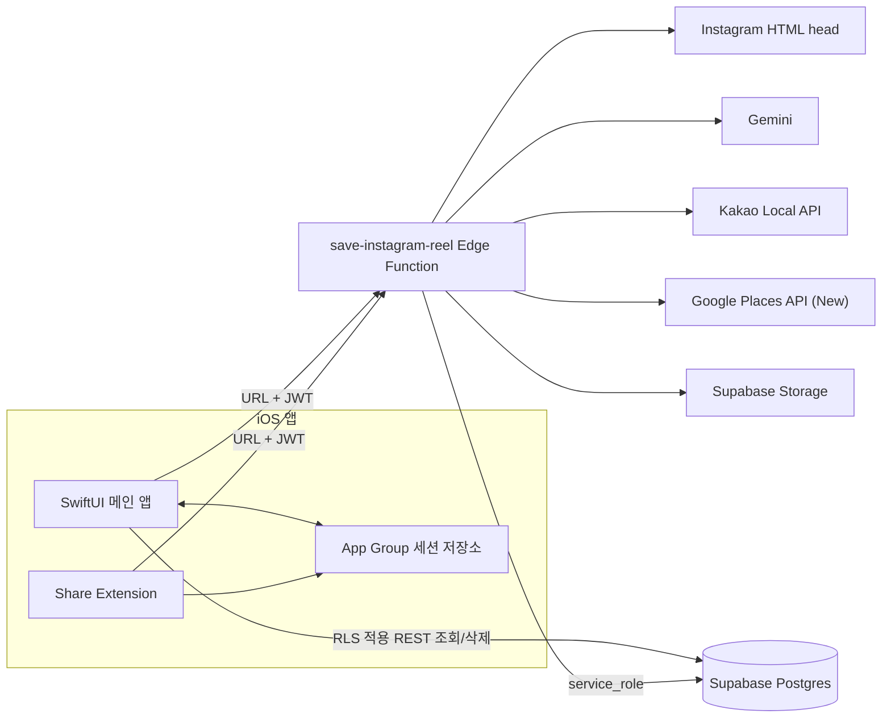
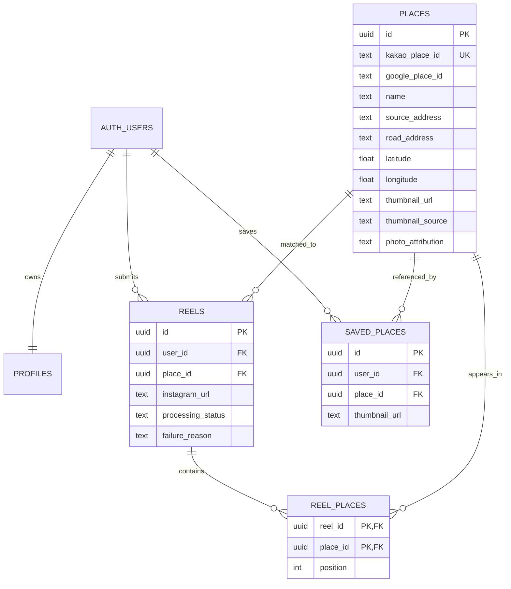

# 여기담 MVP 현재 시스템 설계

- 기준일: 2026-08-11
- 상태: 구현 기준(as-built)
- 대상: iOS 17+, Supabase 프로젝트 `hbbrgudsbvnwuylxqlta`

## 1. 시스템 목표

사용자가 Instagram에서 발견한 장소를 URL 입력 또는 공유 메뉴로 여기담에 전달하면 서버가 릴스 캡션을 읽고 장소를 정규화해 개인 저장 목록에 추가합니다.

설계의 핵심 경계는 다음과 같습니다.

- iOS는 인증, 요청 접수, 결과 조회와 화면 표시를 담당합니다.
- Edge Function은 외부 API 조합과 DB 쓰기를 담당합니다.
- 앱은 `anon` 키와 사용자 JWT만 사용하고, 모든 서버 쓰기는 `service_role`로 수행합니다.
- 사용자별 읽기·삭제 권한은 Postgres RLS가 보장합니다.

## 2. 전체 구조

## 3. iOS 구성

### 메인 앱 `Yeogidam`

- `AppState`: Supabase 익명 세션 시작, 복원, 로그아웃
- `SharedSessionStore`: App Group `group.com.yeogidam`에 access/refresh token 공유
- `YeogidamAPI`: Edge Function 호출과 PostgREST 조회·삭제
- `SavedPlacesView`: 완료 장소와 처리 중·실패 릴스 표시
- `AddByURLSheet`: Instagram URL 직접 입력
- `SavedPlaceDetailView`: 사진, 주소, 카테고리, Kakao 장소 링크와 현재 사용자가 저장한 관련 릴스 목록 표시

Supabase URL과 `anon` 키는 Xcode build setting을 통해 두 타깃의 `Info.plist`에 주입합니다. `anon` 키는 공개 클라이언트 키이며 권한은 RLS로 제한합니다.

### Share Extension

확장은 공유된 `public.url`을 읽고 Instagram 호스트인지 확인한 후 App Group의 access token으로 Edge Function을 호출합니다. 성공 조건은 최종 장소 저장이 아니라 요청 접수 HTTP `2xx`입니다. 무거운 파싱은 확장에서 수행하지 않습니다.

현재 세션 공유는 Keychain이 아니라 App Group `UserDefaults`입니다. MVP 구현은 단순하지만, 배포 전 Keychain Access Group 기반 저장으로 강화하는 것이 권장됩니다.

## 4. Supabase 구성

### Auth

- MVP: 익명 로그인
- JWT 유효시간: 로컬 기본 1시간
- 익명 사용자 생성 시 `profiles` 행 자동 생성
- 향후 Apple/카카오 계정은 익명 계정 링크 방식으로 확장 가능

### 데이터 모델

- `places`: 모든 인증 사용자가 읽는 공용 장소 정규화 결과
- `reels`: 사용자 요청·처리 상태·Instagram shortcode·알고리즘 버전을 보관
- `reel_places`: 하나의 릴스에서 검증된 여러 장소와 성공 결과의 상대 순서
- `saved_places`: 사용자와 장소의 유일한 연결, `(user_id, place_id)` unique
- `provider_usage_monthly`: Google 썸네일 워크플로 예약 횟수

### 권한 경계

| 리소스 | 인증 사용자 | Edge Function `service_role` |
|---|---|---|
| `profiles` | 본인 조회·수정 | 전체 접근 |
| `places` | 전체 조회 | 생성·수정 |
| `reels` | 본인 조회·삭제 | 생성·수정 |
| `saved_places` | 본인 조회·삭제 | 생성·수정 |
| `reel_places` | 본인 `reels`에 연결된 행 조회 | 생성·수정 |
| `provider_usage_monthly` | 접근 불가 | 예약 RPC 실행 |
| `place-thumbnails` | 공개 읽기 | 업로드 |

## 5. 외부 제공자 역할

| 제공자 | 역할 | 실패 시 동작 |
|---|---|---|
| Instagram | 캡션과 원본 썸네일 후보 | `IG_FETCH_FAILED` |
| Gemini | 전체 캡션에서 여러 장소명·주소·지역 구조화 | `PLACE_NOT_FOUND` |
| Kakao Local API | 장소 ID, 이름, 주소, 카테고리, 좌표 정규화 | `PLACE_NOT_FOUND` |
| Google Places | 대표 사진과 Google Place ID | Instagram/Kakao 이미지로 폴백 |
| Supabase Storage | 선택된 썸네일 저장 | 이미지 없이 장소 저장 가능 |

## 6. 비동기 처리 모델

Edge Function은 인증과 입력 검증 후 shortcode 캐시를 먼저 확인합니다. 같은 사용자의 처리 중·완료 행은 기존 상태를 반환하고, 다른 사용자의 현재 버전 완료 결과는 장소 관계만 복사합니다. 캐시가 없을 때 `reels(PROCESSING)`을 생성하고 HTTP `202`를 반환하며 실제 추출은 `EdgeRuntime.waitUntil()`에서 계속됩니다. 실패·구버전·15분 이상 정체된 행은 같은 `reelId`로 재처리합니다.

앱은 저장 직후 `saved_places`와 `reels`를 다시 조회합니다. 현재 Realtime 구독과 자동 polling은 없으며 화면 진입 또는 당겨서 새로고침으로 갱신합니다.

## 7. 구현 상태

### 완료

- 익명 인증과 RLS
- URL 직접 입력과 Share Extension
- Instagram 캡션 다단계 추출
- Gemini-first 다중 장소 추출과 원문 문자열 검증
- Kakao 장소 ID 기준 중복 방지와 유일 후보 확정
- Instagram shortcode 기반 중복 요청 방지와 완료 결과 재사용
- 장소와 사용자 저장 데이터 분리
- Google Places 썸네일, 제공자 폴백, Storage 업로드
- 월간 DB hard cap과 Google Cloud 일일 quota
- 저장 목록, 상세, 삭제, 처리 실패 표시
- 장소 상세의 관련 릴스 다중 조회와 Instagram 원본 이동

### 미완료

- Kakao 지도 실제 화면
- Apple/카카오 로그인과 익명 계정 링크
- Share Extension의 만료 토큰 자체 갱신
- Realtime 또는 polling 기반 자동 완료 반영
- 실패 요청 재시도·삭제 UI
- 운영용 구조화 로그 대시보드와 경보
- 개인정보 처리방침·서비스 약관·Google attribution 완성

## 8. 주요 기술 부채

1. Instagram HTML head의 `og:description`을 우선 캡션 SSOT로 사용하고 일반·Twitter description만 대체한다. 요청 환경에 따라 description이 누락되면 `IG_FETCH_FAILED`다. `og:title`은 파싱·저장·Gemini 입력에 사용하지 않는다. 공개 릴스의 메타데이터 형식 변경과 비로그인 요청 차단에 대한 회귀 테스트·실패 관측이 필요합니다.
2. Share Extension은 access token 만료 시 사용자에게 앱 실행을 요청하며 자체 refresh를 하지 않습니다.
3. 외부 이미지 업로드 실패는 장소 저장을 막지 않지만, 일부 DB update 오류도 현재 best-effort로 처리됩니다.
4. Google Places 사진 재호스팅은 현행 Google Maps Platform 저장 제한과 충돌할 수 있습니다. 프로덕션 출시 전에 [운영 가이드](deployment-and-operations.md)의 정책 항목을 해결해야 합니다.
5. Kakao 장소 ID는 중복은 막지만 오탐을 막지 못합니다. 현재는 이름·지역·건물번호 일치 후 유일한 후보만 저장하며, 상세 기준은 [장소 매칭 보고서](mvp-place-matching-release-report.md)를 참고합니다.
6. Gemini 장소 배열은 현재 최대 10개다. 상한을 초과해 응답에서 제외된 장소는 후속 검증에 들어가지 않으며 포함된 장소가 하나라도 저장되면 전체 상태가 `COMPLETED`라서 절단 여부가 사용자에게 드러나지 않습니다.
7. Kakao 검색은 장소당 최대 세 쿼리를 순차 실행한다. 추출 상한을 확대하려면 제한된 병렬 처리, 릴스당 쿼리 예산, 처리 시간과 절단 여부 관측을 함께 도입해야 합니다.
8. `reel_places.position`은 원문 절대 인덱스가 아니라 검증 성공 결과의 압축 순서다. Gemini가 원문 순서를 지키도록 강제하지도 않아 정확한 캡션 위치 추적에는 사용할 수 없습니다.
9. 다중 장소 쓰기는 하나의 DB 트랜잭션이 아니다. 뒤 장소 저장이 실패하면 앞 장소의 일부 관계가 남을 수 있어 RPC 트랜잭션 또는 보상 정리가 필요합니다.
10. `places.source_address`는 공용 장소의 최근 non-null 원문 주소에 가깝다. 릴스별 주소 이력이 필요하면 관계 테이블로 이동해야 합니다.
11. 알고리즘 변경 시 `PIPELINE_VERSION`을 올리지 않으면 완료된 shortcode는 이전 결과를 재사용한다. 버전 변경과 기존 `saved_places` 정리 정책을 한 릴리스 단위로 관리해야 합니다.
