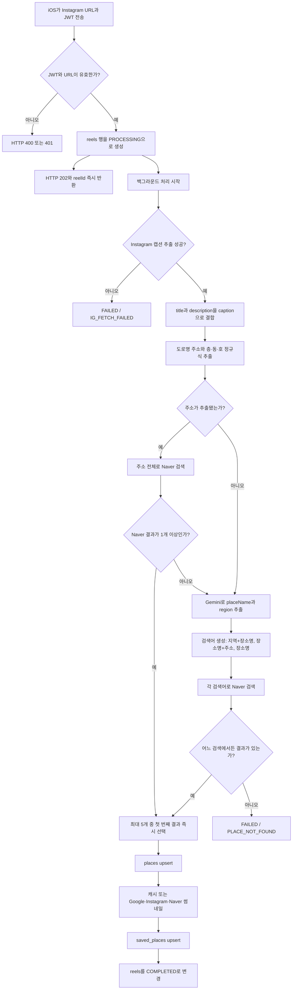
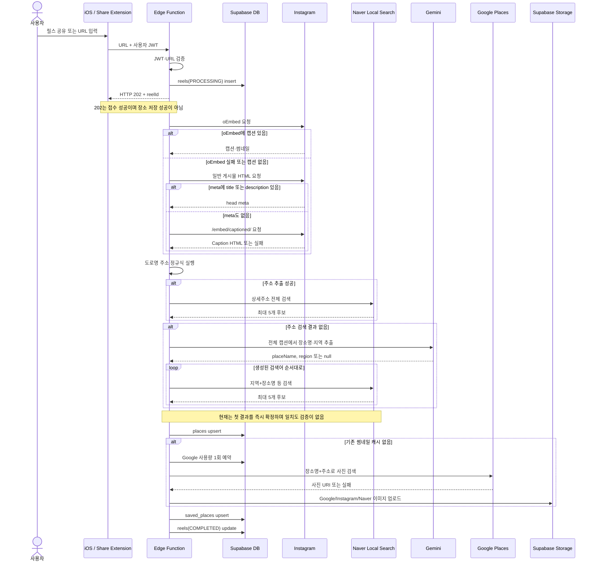
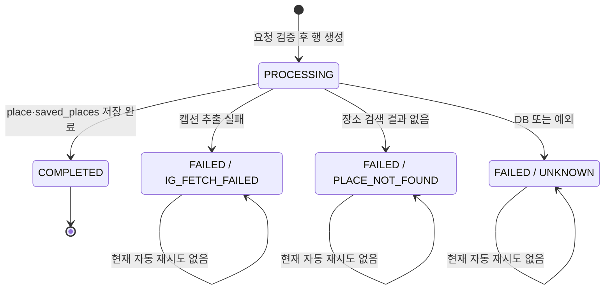
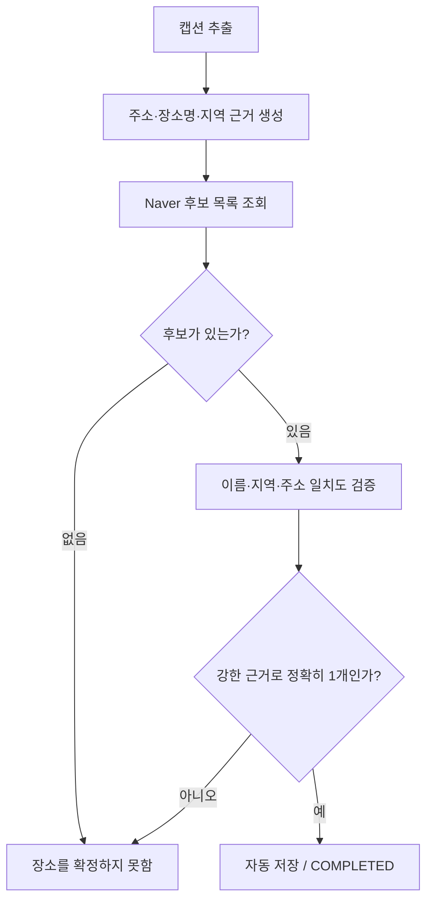

# 여기담 MVP 장소 매칭 알고리즘 및 출시 판단 보고서

- 기준일: 2026-08-10
- 기준 구현: `save-instagram-reel` Edge Function v12
- 목적: 현재 알고리즘을 정확히 설명하고, happy case 중심 MVP 출시 범위를 다시 정의한다.

## 1. 결론 요약

**happy case 파이프라인 자체는 동작한다.** 공개 Instagram 게시물에서 캡션을 가져오고, 특정 가능한 장소명과 지역 또는 주소가 있으며, Naver 검색 결과가 하나로 수렴하면 장소가 정상 저장된다. 실제 `연하동 대학로점` 사례가 이 경로를 통과했다.

다만 **현재 상태 그대로는 출시 준비가 끝났다고 보기 어렵다.** 이유는 장소를 못 찾는 실패보다, 잘못된 장소를 `COMPLETED`로 저장하는 false positive가 있기 때문이다.

- `용용선생`처럼 지점 정보가 없는 브랜드 게시물은 검색 결과 5개 중 임의의 첫 결과인 `종각점`으로 저장됐다.
- `키리`처럼 현재 정규식이 읽지 못하는 지번 주소가 있는 게시물은 캡션의 `광주`와 다른 서울 장소 `키리엑스`로 저장됐다.
- 현재 `COMPLETED`는 "DB 저장까지 완료"라는 기술 상태일 뿐, "캡션의 실제 장소와 일치"한다는 품질 상태가 아니다.

따라서 출시 전 필요한 최소 변경은 알고리즘을 더 크게 만드는 것이 아니다. **근거가 충분한 경우만 자동 저장하고, 애매하면 정직하게 실패시키는 확정 게이트**를 추가하는 것이다.

> 권장 출시 기준: `정확한 후보 1개`만 자동 저장하고, 후보가 없거나 여러 개이거나 지역·주소가 충돌하면 `장소를 확정하지 못함`으로 종료한다.

## 2. MVP의 happy case를 다시 정의하면

초기 목표를 아래 입력 계약으로 제한하면 MVP는 단순하게 유지할 수 있다.

### 지원하는 입력

1. Instagram이 공개 캡션을 반환한다.
2. 캡션이 실제 방문 장소 **하나**를 소개한다.
3. 아래 둘 중 하나가 캡션에 있다.
   - 구체적인 상호명 또는 지점명 + 한국 도로명 주소
   - 구체적인 상호명 또는 지점명 + 동·구·도시 같은 지역명
4. Naver 후보가 입력 근거와 일치하며 하나로 확정된다.

예시:

```text
혜화 <연하동>
서울 종로구 대학로11길 43 1층
```

이 캡션은 장소명 `연하동`, 지역 `혜화`, 도로명 주소와 `1층`을 모두 제공한다. Naver 결과가 `연하동 대학로점` 하나로 수렴하면 자동 저장할 수 있다.

### MVP에서 지원하지 않아도 되는 입력

- 지점이 적혀 있지 않은 프랜차이즈·브랜드 홍보
- 한 게시물에서 여러 장소를 소개하는 모음 글
- 장소명, 주소, 지역이 모두 없는 감상문
- 비공개·삭제·로그인 제한 게시물
- 해외 주소, OCR이 필요한 영상 자막만 있는 게시물
- 후보가 여러 개인데 사용자의 선택이 필요한 경우

이 입력들을 전부 자동 해결하려고 하면 후보 랭킹, 지오코딩, OCR, 다중 장소 모델링, 확인 UI까지 필요해진다. 이것은 happy case MVP의 범위를 넘어선다.

## 3. 현재 구현 구성

| 단계 | 파일 | 현재 역할 |
|---|---|---|
| 요청·전체 조정 | [`index.ts`](../supabase/functions/save-instagram-reel/index.ts) | JWT·URL 검증, 비동기 실행, 장소·썸네일·DB 저장 |
| Instagram 추출 | [`instagram.ts`](../supabase/functions/save-instagram-reel/instagram.ts) | oEmbed, 일반 HTML meta, embed caption 순서로 캡션 추출 |
| 주소 파싱 | [`address.ts`](../supabase/functions/save-instagram-reel/address.ts) | 한국 도로명 주소와 층·동·호 추출 |
| AI 추출 | [`gemini.ts`](../supabase/functions/save-instagram-reel/gemini.ts) | 캡션에서 `placeName`, `region` 구조화 추출 |
| 장소 검색 | [`naver.ts`](../supabase/functions/save-instagram-reel/naver.ts) | Naver 지역 검색 후 첫 번째 결과를 장소로 정규화 |
| Google 사진 | [`google.ts`](../supabase/functions/save-instagram-reel/google.ts) | 확정 장소의 첫 사진 조회 |
| 이미지 저장 | [`thumbnail.ts`](../supabase/functions/save-instagram-reel/thumbnail.ts) | 외부 이미지를 Supabase Storage에 재호스팅 |
| iOS 상태 표시 | [`YeogidamModels.swift`](../ios/Yeogidam/YeogidamModels.swift) | 처리 상태와 실패 문구 매핑 |

중요한 순서는 **주소 파싱 → 주소로 Naver 검색 → 실패한 경우에만 Gemini → 장소명으로 Naver 재검색**이다. `📍` 같은 특정 이모지를 기준으로 장소명을 단정하는 코드는 현재 없다.

## 4. 현재 알고리즘 플로우차트

아래는 권장안이 아니라, 배포된 코드가 현재 수행하는 동작 그대로다.



### 플로우차트에서 특히 봐야 하는 지점

`Naver 결과가 1개 이상인가?` 다음이 `후보 검증`이 아니라 **첫 번째 결과 선택**이다. Naver 호출은 `display=5&sort=random`이고, `naver.ts`는 `items[0]`만 반환한다.

즉 다음 세 경우가 코드상 동일하게 처리된다.

- 정확한 후보가 딱 1개인 경우
- 같은 건물에 여러 장소가 나온 경우
- 전국 지점 5개가 나온 경우

셋 모두 첫 번째 항목을 선택하고 `COMPLETED`가 된다. 현재 오류의 중심은 파싱 자체보다 이 확정 단계다.

## 5. 현재 처리 시퀀스



앱은 `202`를 받자마자 성공 토스트를 보일 수 있지만, 서버 처리는 그 뒤에 계속된다. 현재 자동 polling이나 Realtime 구독은 없어서 최종 결과는 화면 재진입 또는 당겨서 새로고침 때 반영된다.

## 6. 현재 구현의 의사코드

### 6.1 요청 접수

```text
function handleRequest(request):
    if HTTP method is not POST:
        return 405

    user = verifySupabaseJWT(request.Authorization)
    if user does not exist:
        return 401

    input = parseJSON(request.body)
    if input.instagramUrl is not an allowed Instagram URL:
        return 400

    reel = insert reels(
        user_id = user.id,
        instagram_url = input.instagramUrl,
        status = PROCESSING
    )

    run processReel(reel) in background
    return 202 { reelId, status: PROCESSING }
```

### 6.2 캡션과 장소 처리

```text
function processReel(reel):
    meta = firstSuccessfulResult(
        Instagram oEmbed,
        Instagram page head metadata,
        Instagram captioned embed HTML
    )

    if meta cannot be extracted:
        fail reel with IG_FETCH_FAILED
        return

    caption = join(meta.title, meta.description)
    save Instagram metadata to reels

    address = regexExtractRoadAddressWithDetails(caption)
    place = null

    if address exists:
        place = searchNaverPlace(address)
        # searchNaverPlace returns only items[0]

    if place is null:
        guess = Gemini.extract(caption)
        placeName = guess.placeName
        region = guess.region

        queries = uniqueNonEmpty([
            region + placeName,
            placeName + address,
            placeName
        ])

        for query in queries:
            place = searchNaverPlace(query)
            if place exists:
                break

    if place is null:
        fail reel with PLACE_NOT_FOUND
        return

    placeRow = upsert places by naver_place_id
    thumbnail = cached thumbnail
        or Google Places photo
        or Instagram thumbnail
        or Naver page image
        or null

    upsert saved_places by (user_id, place_id)
    complete reel with place_id
```

### 6.3 Naver 검색의 실제 의미

```text
function searchNaverPlace(query):
    response = Naver Local Search(
        query = query,
        display = 5,
        sort = random
    )

    if API failed or items is empty:
        return null

    return normalize(response.items[0])
```

함수 이름은 장소를 "검색"하는 것처럼 보이지만, 실제로는 **검색과 확정을 한 번에 수행**한다. 후보 배열과 후보 수가 호출자에게 전달되지 않기 때문에 `index.ts`는 애매한 검색인지 알 수 없다.

## 7. 단계별 예시로 이해하기

### 예시 A: 도로명 주소는 있지만 주소 검색 결과가 없는 정상 사례

캡션 요약:

```text
혜화 <연하동>
서울 종로구 대학로11길 43 1층
```

실제 처리:

1. 정규식이 `서울 종로구 대학로11길 43 1층`을 추출한다.
2. 해당 문자열로 Naver를 검색했지만 결과가 0개였다.
3. 주소가 있어도 Naver 검색이 실패했으므로 Gemini가 호출된다.
4. Gemini가 `placeName=연하동`, `region=혜화`를 반환했다.
5. 첫 재검색어 `혜화 연하동`이 후보 1개를 반환했다.
6. 그 첫 후보 `연하동 대학로점`이 저장됐다.

판정: **happy case 성공.** 주소 검색이 직접 성공한 것은 아니지만, 장소명과 지역이 충분했고 결과가 하나로 수렴했다.

### 예시 B: 주소 없이 브랜드명만 있는 false positive

캡션 요약:

```text
용용선생 마라떡찜 역대급 신메뉴
근처 매장을 검색해 보세요
#용용선생
```

실제 처리:

1. 도로명 주소가 없으므로 주소 검색은 생략된다.
2. Gemini가 `placeName=용용선생`, `region=null`을 반환했다.
3. 생성 가능한 검색어는 `용용선생` 하나뿐이다.
4. Naver가 서로 다른 지점 후보 5개를 반환했다.
5. 현재 코드는 후보가 여러 개인지 확인하지 않고 첫 번째인 `용용선생 종각점`을 선택했다.
6. DB 저장이 성공했으므로 상태는 `COMPLETED`가 됐다.

판정: **기술적 성공, 의미상 실패.** 원본 게시물은 특정 지점을 말하지 않았으므로 올바른 답은 `종각점`이 아니라 `확정 불가`다.

### 예시 C: 지번 주소를 정규식이 읽지 못한 false positive

캡션 요약:

```text
서울 바이브 낭낭한 힙한 이자카야
키리
광주 동구 동명동 200-188
```

실제 처리:

1. `광주 동구 동명동 200-188`은 지번 주소다.
2. 현재 정규식은 `...로` 또는 `...길`이 있는 도로명 주소만 지원하므로 `address=null`이 된다.
3. 주소 우선 검색이 생략되고 Gemini·장소명 검색 경로로 내려간다.
4. 후보의 이름·지역 일치 검증이 없어서 서울의 `키리엑스`가 저장됐다.
5. 장소 저장 자체는 성공했으므로 `COMPLETED`가 됐다.

판정: **false positive.** 캡션에 `광주`라는 강한 반증이 있는데도 후보 주소가 서울인지 검사하지 않았다.

### 예시 D: 같은 건물에 여러 장소가 있는 경우

캡션:

```text
보연희
서울 서대문구 연희맛로 17-63 2층
```

현재 처리:

1. 층까지 포함해 `서울 서대문구 연희맛로 17-63 2층`을 추출한다.
2. 이 전체 주소로 Naver를 검색한다.
3. Naver가 같은 건물의 여러 사업장을 반환하면 첫 후보를 선택한다.
4. `2층`을 추출하고 `source_address`에 저장하기는 하지만, 후보 주소·층·상호의 일치도를 비교하지 않는다.

따라서 "상세주소를 보존한다"와 "상세주소로 정확한 점포를 확정한다"는 다르다. 현재는 전자만 구현되어 있다.

권장 처리:

1. 주소로 후보 목록을 받는다.
2. 후보가 하나면 주소의 기본 번지와 지역이 일치하는지 확인한다.
3. 후보가 여러 개면 Gemini로 상호명을 얻는다.
4. `상호명 일치 + 건물 주소 일치` 후보가 정확히 하나일 때만 저장한다.
5. 여전히 여러 개면 MVP에서는 `확정 불가`로 종료한다. 층 정보만으로 억지 선택하지 않는다.

### 예시 E: 과거 `오르노 성수점` 실패 행

캡션 요약:

```text
오르노 성수점
서울 성동구 뚝섬로17가길 49 1층
```

정규식은 상세주소를 정상 추출했지만 Naver 주소 검색 결과가 없었고, 당시 사용하던 Gemini 모델 호출도 실패해 `PLACE_NOT_FOUND`로 남았다. 이후 Gemini 기본 모델을 교체했지만 **기존 실패 행은 자동 재처리되지 않는다.** 따라서 이 행은 최신 알고리즘을 다시 실행한 결과가 아니라 과거 버전의 이력이다.

## 8. reels 상태 모델



### 상태 해석 시 주의점

| 상태 | 현재 보장하는 것 | 현재 보장하지 않는 것 |
|---|---|---|
| `PROCESSING` | 요청이 접수되어 백그라운드 작업 중 | 최종 성공 |
| `COMPLETED` | `places`, `saved_places`, `reels` DB 작업 완료 | 원본 캡션과 장소가 의미상 일치 |
| `FAILED` | 저장 파이프라인이 종료됨 | 재시도 가능 여부, 정확한 외부 제공자 원인 |

현재 실패 사유는 세 개뿐이다.

| 실패 사유 | 포함되는 실제 원인 |
|---|---|
| `IG_FETCH_FAILED` | Instagram 차단, HTTP 오류, 세 추출 경로 모두 캡션 없음 |
| `PLACE_NOT_FOUND` | Naver 키 누락, Naver 0건 또는 API 오류, Gemini 키 누락·오류·null, 모든 검색어 0건 |
| `UNKNOWN` | `places` upsert 실패 또는 처리 중 예외 |

`AMBIGUOUS_PLACE`, `REGION_MISMATCH`, `GEMINI_FAILED` 같은 구분은 아직 없다. 특히 애매한 후보는 실패가 아니라 첫 후보 성공으로 흘러간다.

## 9. 현재 프로덕션 사례 관찰

2026-08-10 확인 시점의 `reels` 4건을 결과 의미까지 분류하면 다음과 같다.

| shortcode | DB 상태 | 캡션의 핵심 근거 | 저장 결과 | 의미 판정 |
|---|---|---|---|---|
| `Db0ZlOZzfws` | `FAILED / PLACE_NOT_FOUND` | 오르노 성수점 + 성수 도로명 주소·1층 | 없음 | 과거 모델 오류가 포함된 실패 이력 |
| `DbF7Dhoku-v` | `COMPLETED` | 연하동 + 혜화 + 도로명 주소·1층 | 연하동 대학로점 | 정확 |
| `DGz7Y8Nyx9Y` | `COMPLETED` | 용용선생, 지점·지역·주소 없음 | 용용선생 종각점 | 잘못된 지점 확정 |
| `DaNAJL0JXWo` | `COMPLETED` | 키리 + 광주 지번 주소 | 서울 키리엑스 | 지역까지 다른 잘못된 확정 |

표면적인 기술 완료율은 `3 / 4 = 75%`다. 하지만 확인 가능한 완료 3건 중 의미상 정확한 결과는 1건뿐이다. 이 표본은 매우 작고 서로 다른 배포 버전의 이력이 섞여 있으므로 정확도 지표로 일반화할 수는 없다. 그래도 **`COMPLETED` 건수를 성공률로 사용하면 안 된다**는 사실은 충분히 보여준다.

## 10. 실패할 수 있는 케이스 목록

### 10.1 Instagram 입력 단계

| 케이스 | 캡션 또는 게시물 상태 예시 | 현재 결과 |
|---|---|---|
| 비공개·삭제 게시물 | 로그인한 앱에서는 보이지만 서버 비로그인 요청에는 안 보임 | `IG_FETCH_FAILED` |
| oEmbed와 meta 캡션 누락 | 이미지 meta만 있고 설명이 없음 | embed까지 실패하면 `IG_FETCH_FAILED` |
| Instagram HTML 변경 | `Caption` 클래스나 meta 구성이 변경됨 | 파서 실패 가능 |
| 영상 자막에만 장소가 있음 | HTML 캡션은 `여기 진짜 맛있다`뿐 | 장소 근거 없음 |

### 10.2 주소 파싱 단계

| 케이스 | 캡션 예시 | 현재 파싱 |
|---|---|---|
| 도로명 + 층 | `서울 마포구 연남로1길 44 B1층` | 전체 추출 |
| 이모지 없음 | `터틀힙 연남 서울 마포구 연남로1길 44 1층` | 이모지와 무관하게 추출 |
| 지번 주소 | `광주 동구 동명동 200-188` | 추출 실패 |
| 시·도 생략 | `연희동 연희맛로 17-63` | 추출 실패 가능 |
| 괄호·쉼표가 상세주소 사이에 있음 | `서울 ... 49, 1층` | 층이 잘릴 수 있음 |
| 복합 상세주소 | `A동 2층 201호` | 숫자 동만 지원해 일부 누락 가능 |
| 해외 주소 | `2-1-1 Shibuya, Tokyo` | 지원하지 않음 |

### 10.3 장소 추출·검색 단계

| 케이스 | 캡션 예시 | 현재 위험 |
|---|---|---|
| 전국 프랜차이즈, 지점 없음 | `용용선생 신메뉴 출시` | 임의 지점 false positive |
| 같은 이름의 독립 매장 | `키리 분위기 좋아요` | 다른 지역 동명 장소 선택 |
| 같은 건물 여러 점포 | `서울 ... 17-63 2층` | 주소 검색 첫 후보 선택 |
| 장소 여러 개 소개 | `성수 카페 5곳 모음` | Gemini가 임의의 한 곳 선택 가능 |
| 폐업·이전·신규 오픈 | Naver에 아직 없거나 옛 주소만 있음 | 0건 또는 오래된 후보 |
| 상호의 별칭만 사용 | `연트럴파크 그 빵집` | Gemini·Naver 모두 실패 가능 |
| 광고 계정명과 매장명 혼재 | `@creator가 @brand를 소개` | 크리에이터·브랜드 오인 가능 |
| Gemini 할당량·모델 오류 | API 429, 모델 404, 잘못된 JSON | 내부적으로 null, 최종 `PLACE_NOT_FOUND` |
| Naver 인증·할당량 오류 | API 401, 429, 5xx | 내부적으로 null, 최종 `PLACE_NOT_FOUND` |

### 10.4 저장·이미지 단계

| 케이스 | 현재 결과 |
|---|---|
| 장소 upsert 실패 | `UNKNOWN` |
| `saved_places` upsert 오류 | 현재 오류를 검사하지 않아도 뒤에서 `COMPLETED` 가능 |
| Google 월간 cap 도달 | Instagram 이미지로 폴백 |
| Google 사진 없음·API 실패 | Instagram, Naver 순서로 폴백 |
| 모든 이미지 실패 | 장소는 `COMPLETED`, 앱 placeholder 표시 |
| Storage 업로드 실패 | 다음 이미지 소스로 폴백, 모두 실패해도 장소 저장 가능 |

썸네일 실패는 장소 식별 실패와 분리되어 있다. 이것은 MVP 관점에서 적절하다. 장소가 정확하다면 이미지가 없어도 저장할 수 있다.

## 11. 출시용 최소 알고리즘 권장안

목표는 더 많은 게시물을 억지로 성공시키는 것이 아니라, 지원 범위 안에서 틀린 장소를 저장하지 않는 것이다.



### 확정 규칙의 최소 형태

다음 중 하나를 만족할 때만 자동 저장한다.

1. **주소 기반 단일 후보**
   - 도로명 기본 번지와 지역이 캡션 주소와 일치한다.
   - 일치 후보가 정확히 하나다.
2. **장소명 + 지역 기반 단일 후보**
   - 후보 이름이 Gemini 장소명과 정규화 후 일치한다.
   - 후보 주소의 시·구·동이 캡션 지역과 충돌하지 않는다.
   - 일치 후보가 정확히 하나다.
3. **같은 건물의 여러 후보**
   - 장소명과 건물 주소가 동시에 일치하는 후보가 정확히 하나일 때만 저장한다.
   - 층 정보는 보조 근거로 사용하되 Naver 데이터에 층이 없으면 강제로 확정하지 않는다.

다음 경우는 자동 저장하지 않는다.

- 후보가 2개 이상 남음
- 장소명만 있고 지역·주소가 없음
- 캡션 지역과 후보 주소가 충돌함
- 캡션이 여러 장소를 소개함
- Gemini 또는 Naver가 오류를 반환함

### 권장 의사코드

```text
signals = {
    address: regexExtractAddress(caption),
    placeName: null,
    region: null
}

candidates = []

if signals.address exists:
    candidates += naverSearchAll(signals.address)

if candidates do not produce exactly one verified match:
    guess = Gemini.extract(caption)
    signals.placeName = guess.placeName
    signals.region = guess.region
    candidates += naverSearchAll(buildQueries(signals))

verified = candidates
    .deduplicateByNaverPlaceId()
    .filter(candidate does not conflict with signals.region)
    .filter(candidate address matches signals.address when address exists)
    .filter(candidate name matches signals.placeName when placeName exists)

if verified.count == 1:
    save verified[0]
    mark COMPLETED
else:
    do not save any place
    mark FAILED / AMBIGUOUS_PLACE or PLACE_NOT_FOUND
```

이 변경은 "모든 애매한 게시물을 해결하는 알고리즘"이 아니다. 기존 API 호출을 유지하면서 **검색 결과 배열을 보존하고 저장 직전 검증하는 얇은 안전장치**다.

## 12. 출시 우선순위

### P0: MVP 출시 전에 필요

1. `searchNaverPlace()`가 첫 항목이 아니라 후보 배열을 반환하도록 변경한다.
2. `sort=random`에 기대는 임의 확정을 제거한다.
3. 장소명·지역·주소 충돌 검사와 `후보 정확히 1개` 게이트를 추가한다.
4. 애매한 경우 장소를 저장하지 않고 실패 처리한다.
5. `용용선생`, `키리`, 같은 건물 다중 점포를 회귀 테스트 fixture로 추가한다.
6. `saved_places` upsert 오류를 확인한 뒤에만 `COMPLETED`로 바꾼다.

실패 사유를 단순하게 유지하려면 P0에서는 애매한 경우도 기존 `PLACE_NOT_FOUND`로 묶을 수 있다. 제품 문구가 중요하면 `AMBIGUOUS_PLACE`를 DB 제약과 iOS enum에 함께 추가한다.

### P1: 출시 직후 개선

- 한국 지번 주소 정규식 추가
- 실패 요청 재시도·삭제 UI
- 처리 완료 자동 polling 또는 Realtime
- `AMBIGUOUS_PLACE`, `PROVIDER_ERROR`, `REGION_MISMATCH` 같은 관측용 사유 세분화
- 후보와 선택 근거를 저장하는 구조화 로그
- 사용자가 장소를 확인·수정하는 단일 확인 화면

### 지금 만들지 않아도 되는 것

- 전국 모든 동명 장소의 정교한 랭킹 모델
- 영상 OCR과 음성 인식
- 한 게시물의 여러 장소 자동 분리
- 모든 이모지·문장 형식별 규칙
- 자체 지도·지오코딩 엔진

## 13. 출시 승인용 테스트 매트릭스

P0 구현 후 아래 입력은 자동화 테스트와 실제 provider smoke test로 확인하는 것이 좋다.

| ID | 입력 유형 | 예시 | 기대 결과 |
|---|---|---|---|
| H1 | 구체 상호 + 도로명 + 층 | `보연희 / 서울 ... 17-63 2층` | 정확한 한 후보 저장 |
| H2 | 상호 + 지역, 주소 검색 0건 | `혜화 연하동 / 서울 ... 43 1층` | Gemini 폴백 후 정확 저장 |
| H3 | 이모지 없음 | `터틀힙 연남 서울 ... 44 1층` | 이모지와 무관하게 저장 |
| F1 | 브랜드만 있음 | `용용선생 신메뉴` | 저장하지 않음 |
| F2 | 같은 건물 여러 매장 | 동일 번지의 후보 2개 이상 | 이름으로 하나가 확정되지 않으면 저장하지 않음 |
| F3 | 지번 주소 | `광주 동구 동명동 200-188` | P0에서는 안전 실패, P1 지원 후 정확 저장 |
| F4 | 지역 충돌 | 캡션 `광주`, 후보 주소 `서울` | 저장하지 않음 |
| F5 | 장소 여러 개 | `성수 카페 5곳` | 저장하지 않음 |
| F6 | 비공개·삭제 릴스 | 서버가 캡션을 가져올 수 없음 | `IG_FETCH_FAILED` |
| F7 | Gemini 429 | 주소 검색 실패 후 AI 할당량 초과 | 저장하지 않음 |
| F8 | 이미지 모두 실패 | 장소는 정확히 확정됨 | 장소 저장, placeholder 표시 |

### 출시 통과 조건

- H1~H3가 정확한 장소로 `COMPLETED`된다.
- F1~F7가 **다른 장소를 저장하지 않는다.**
- F8은 이미지가 없어도 장소가 저장된다.
- 앱의 성공 표시는 HTTP `202` 접수와 최종 `COMPLETED`를 혼동하지 않는다.

## 14. 최종 출시 판단

현재 구현은 "happy case가 되는가?"라는 질문에는 **예**다. 캡션 추출, 주소 보존, Gemini 폴백, Naver 정규화, 이미지 저장, 사용자 장소 저장까지 전체 경로가 실제로 동작한다.

하지만 "이제 그대로 출시해도 되는가?"라는 질문에는 **아직은 아니오**다. P0에서 필요한 것은 기능 확장이 아니라 false positive 차단이다. 현재처럼 첫 후보를 즉시 저장하면 사용자는 조용한 실패보다 더 치명적인 잘못된 장소를 자신의 목록에서 보게 된다.

가장 작은 출시 버전은 다음과 같다.

> 공개 캡션에서 특정 장소와 지역·주소 근거를 얻고, Naver에서 일치 후보 하나를 확정할 수 있을 때만 자동 저장한다. 나머지는 `장소를 확정하지 못했어요`로 끝낸다.

이 기준이면 MVP는 다시 작아진다. 후보 선택 화면이나 모든 캡션 형식 지원 없이도 출시할 수 있고, 이후 실제 실패 캡션을 모아 지원 범위를 단계적으로 넓힐 수 있다.
