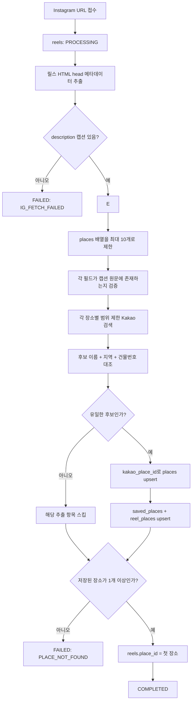
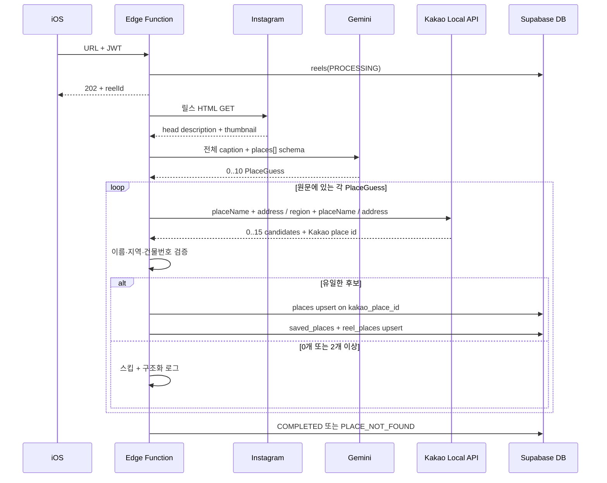

# 여기담 MVP 장소 매칭 및 출시 판단 보고서

- 기준일: 2026-08-11
- 기준 구현: Instagram HTML-head-only + Gemini-first 다중 추출 + Kakao Local API 검증
- 대상: `save-instagram-reel` Edge Function

> **2026-08-18 정책 변경:** 이 문서의 후보 매칭과 10개 상한 설명은 2026-08-11 출시 판단 당시의 기록이다. 현재 구현은 장소명 단독 Kakao 검색 후 `0개=실패`, `1개=즉시 선택`, `2개 이상=주소·지역으로 유일 후보를 찾거나 전체 후보를 2차 Gemini에 전달`하며, Gemini 장소 추출·2차 판단의 애플리케이션 개수 상한도 제거했다. 이름 접미사·한 글자 오타·도로 숫자 전치·검색 fallback과 Gemini 선택 후 이름·주소 재검증은 제거했다. 최신 실행 계약은 [릴스 장소 저장 구현 플로우](save-instagram-reel-flow.md)를 기준으로 한다.

## 1. 결론

현재 MVP는 릴스 HTML head의 `og:description`을 캡션 SSOT로 사용한다. 없으면 `name="description"`, `twitter:description` 순서로 같은 description 계열만 대체한다. 선택한 description 하나를 Gemini에 보내 장소명과 상세 주소를 다중 추출한 뒤, Kakao Local API 후보의 이름과 주소를 원문과 다시 대조한다. 유일하게 검증된 후보만 저장하고, 중복은 Kakao 장소 ID로 막는다.

이 선택의 의미는 다음과 같다.

- `places.id`: 여기담 내부 UUID PK, FK와 사용자 저장 관계에 사용
- `places.kakao_place_id`: Kakao Local API의 외부 자연키, `UNIQUE`
- 이름·주소·좌표: 표시와 후보 검증용, 유일키가 아님
- 정규식: 커버리지 관측과 향후 fallback 연구용, 현재 저장 결정에 사용하지 않음

Kakao 장소 ID는 같은 건물의 층별 매장을 구분할 수 있지만, **잘못된 후보를 골랐다면 그 오탐을 막아주지는 않는다.** 따라서 외부 ID와 후보 검증은 둘 다 필요하다.

## 2. MVP happy case

다음 조건을 만족하면 자동 저장 대상이다.

1. Instagram HTML head의 `og:description`, `name="description"`, `twitter:description` 순서로 캡션을 읽을 수 있다.
2. 캡션에 실제 장소명과 주소 또는 충분한 지역이 있다.
3. Gemini가 그 문자열을 추론하지 않고 원문 그대로 반환한다.
4. Kakao 키워드 검색에서 이름과 주소가 맞는 후보가 하나만 남는다.

다음은 MVP에서 자동 저장하지 않아도 되는 입력이다.

- 상호 또는 주소가 전혀 없는 릴스
- OCR을 해야만 장소를 알 수 있는 릴스
- 비공개·삭제·연령 제한으로 익명 HTML에 캡션 메타데이터가 없는 릴스
- `용용선생` 같이 지점 근거 없이 브랜드명만 있는 캡션
- 이름·주소 일치 후보가 두 개 이상인 모호한 캡션

## 3. 전체 플로우



## 4. 시퀀스



## 5. 의사코드

```text
htmlMeta = fetchInstagramHtmlHead(url)
caption = firstNonEmpty(
  htmlMeta.ogDescription,
  htmlMeta.description,
  htmlMeta.twitterDescription
)

if caption is empty:
    fail(IG_FETCH_FAILED)

regexAddresses = extractAllRoadAddresses(caption)  // shadow log only

// 현재 10은 Gemini 제약이 아니라 여기담의 MVP 안전 상한이다.
rawPlaces = Gemini.extractPlaces(caption, maxItems=10)
guesses = rawPlaces
  .keep(placeName literally appears in caption)
  .keep(address or region literally appears in caption)
  .deduplicate()

matches = []
for guess in guesses:
    queries = unique([
      guess.placeName + guess.address,
      guess.region + guess.placeName,
      guess.address
    ])

    // placeName 단독 전국 검색은 만들지 않음
    candidates = Kakao.keywordSearchAll(queries)
    verified = candidates
      .filter(name matches guess.placeName or valid branch suffix)
      .filter(region tokens match)
      .filter(building number matches when address exists)
      .uniqueBy(kakaoPlaceId)

    if verified.count == 1:
        matches.add(verified.first)

matches = matches.uniqueBy(kakaoPlaceId)
if matches.empty:
    fail(PLACE_NOT_FOUND)

for match in matches:
    place = upsert places on kakao_place_id
    upsert saved_places(user_id, place.id)
    upsert reel_places(reel_id, place.id, matched_result_order)

complete(reels.place_id = matches.first.internalUuid)
```

## 6. 다중 장소 정책

하나의 릴스에 주소가 여러 개면 하나만 고를 이유가 없다. Gemini 응답은 단일 객체가 아닌 `places[]`이며, 각 항목을 독립적으로 Kakao에서 검증한다.

- 현재 최대 추출: Gemini 응답 기준 10개
- 각 장소: 0개 또는 2개 이상 후보면 스킵
- 부분 성공: 적어도 1개가 검증되면 그 장소들은 저장
- 전체 실패: 검증된 장소가 0개면 `PLACE_NOT_FOUND`
- 순서: `reel_places.position`에 검증 성공 결과의 상대 순서 저장
- 호환성: `reels.place_id`는 첫 번째 장소를 계속 가리킴

### 10개 상한의 의미

`10`은 Gemini API가 요구하는 기술 제한이나 측정된 최적값이 아니다. 다중 장소 기능을 도입할 때 비정상적으로 긴 모델 응답과 후속 외부 API 호출량을 제한하기 위해 넣은 MVP 안전 상한이다. `gemini.ts`의 structured output `maxItems`와 응답 파서의 `slice(0, 10)`에 같은 값이 중복 적용된다.

장소 하나는 현재 Kakao 검색 쿼리를 최대 세 개 생성하고, 쿼리와 장소를 순차 처리한다. 따라서 10개는 이론상 Kakao 키워드 검색 최대 30회로 이어진다. 새 장소로 확정되면 장소마다 Google Text Search와 Photo 요청, Storage 업로드도 추가될 수 있다. Gemini는 캡션당 한 번만 호출되므로 장소 수 증가의 주된 지연은 Gemini 호출 횟수가 아니라 후속 Kakao·사진·Storage 작업이다.

중요한 현재 동작은 다음과 같다.

- 캡션에 11개 이상이 있어도 Gemini 응답은 최대 10개다.
- 10개 중 하나라도 저장되면 릴스 전체 상태는 `COMPLETED`다.
- 10개를 초과해 제외된 항목이 있다는 별도 상태, 경고, DB 컬럼은 없다.
- 따라서 사용자는 정상 완료로 보지만 일부 장소가 없는 **조용한 부분 성공**이 된다.
- 이 상한은 비용 방어에는 유효하지만 맛집·여행지 모음 릴스 커버리지에는 낮다.

Gemini 프롬프트는 현재 `캡션 노출 순서대로 반환`을 명시하지 않는다. 대부분 원문 순서를 따르지만 API 계약으로 보장되지 않으며, `maxItems: 10`일 때 어떤 10개를 선택할지도 엄밀히 보장되지 않는다. 또한 매칭 실패 항목은 저장 전에 제거되므로 원문 1·3·5번째만 성공하면 `reel_places.position`은 0·1·2로 압축된다. 따라서 `position`은 원문 절대 인덱스가 아니라 성공 결과의 표시 순서다.

## 7. 예시

### 보연희

```text
📍보연희
서울 서대문구 연희맛로 17-63 2층
```

Gemini는 상호와 `2층`까지 포함한 주소를 반환한다. Kakao 후보의 이름이 `보연희`이고 도로명 건물번호가 `17-63`이면 해당 Kakao ID를 저장한다. 층수는 `source_address`에 보존된다.

### 키리와 키리엑스

```text
키리
광주 동구 동명동 200-188
```

서울의 `키리엑스`는 이름과 광주 지역이 둘 다 틀리므로 제거된다. Kakao ID가 있다는 이유만으로 저장하지 않는다.

### 같은 건물의 여러 매장

```text
보연희 / 서울 서대문구 연희맛로 17-63 2층
다른카페 / 서울 서대문구 연희맛로 17-63 4층
```

지오코딩 좌표는 같거나 매우 가까울 수 있다. 좌표로 유니크를 걸지 않고, 서로 다른 Kakao 장소 ID와 상호로 두 매장을 구분한다.

### 여러 장소 모음

```text
1. 키리 - 광주 동구 동명동 200-188
2. 보연희 - 서울 서대문구 연희맛로 17-63 2층
```

Gemini가 두 개의 원소를 반환하고, Kakao에서 각각 유일하게 검증되면 `saved_places`에 두 행, `reel_places`에 순서 0과 1로 저장된다.

### 광주 장소 모음과 10개 경계

실제 캡션이 다음 순서로 장소를 포함했다고 가정한다.

```text
손탁앤아이허, 애플파이오더, 못카페, 해,
오월밥집, 구미구미, 수담, 평화식당,
블랭크테잎, 재월, 공오일팔, 차시, ...
```

실제 2026-08-11 처리 결과에서는 `블랭크테잎`이 9번째, `재월`이 10번째로 추출됐다. `공오일팔`은 Gemini 응답에 포함되지 않아 Kakao 검색 단계에 들어가지도 않았다. 앞의 장소들이 저장되므로 릴스 상태는 `COMPLETED`이며, 이는 `공오일팔`의 파싱 또는 Kakao 매칭 실패가 아니다. 다른 캡션에서도 항상 원문 앞 10개가 선택된다고 보장할 수는 없다.

주소가 없는 `블랭크테잎`, `재월` 같은 항목은 캡션에 실제 적힌 `광주` 지역 근거를 Gemini가 함께 반환하고 Kakao에서 이름·지역이 유일하게 일치할 때 저장된다. 상한을 늘리더라도 이름만 있고 주소·지역 근거가 없거나 후보가 여러 개면 해당 항목은 계속 스킵된다.

### 연령 제한 계정

`아리꿀꿀꽈배기` 릴스처럼 계정이 `15세 이상`으로 제한되면 로그인한 성인 사용자의 브라우저에는 릴스와 head 메타데이터가 보이지만, Instagram 계정 정보가 없는 Edge Function 요청에는 오류 페이지가 반환될 수 있다. 이때 HTML head에 캡션이 없으면 Gemini와 Kakao 단계로 넘어가지 않고 `IG_FETCH_FAILED`가 된다. 이는 장소 파싱 실패가 아니라 HTML-head-only MVP 입력 범위 밖의 실패다.

## 8. 정규식 조사

### 도로명 주소 후보

현재 구현은 다음 형태를 지원한다.

```regex
(?:시·도)\s*(?:시·군·구)\s*(?:대로|로|길)\s*\d+(?:-\d+)?(?:\s+상세주소)*
```

예: `서울 서대문구 연희맛로 17-63 2층`, `경기 성남시 판교역로 12 101동 202호`

### 지번 주소 후보

향후 관측용 정규식은 다음 구조를 기준으로 할 수 있다.

```regex
(?:시·도\s+)?(?:시·군·구\s+)*(?:읍|면|동|가|리)\s+(?:산\s*)?\d+(?:-\d+)?(?:번지)?(?:\s+상세주소)*
```

예: `광주 동구 동명동 200-188`, `제주 제주시 애월읍 곽지리 산 12-3`

단일 `match()`가 아닌 전역 `matchAll()`로 모든 주소 후보를 노출 순서대로 뽑아야 한다. 현재 `address.ts`의 도로명 관측도 이 방식으로 여러 주소를 반환한다.

### 정규식만으로 부족한 이유

- 시·도 생략, 세종처럼 계층이 다른 행정구역
- `산`, `번지`, 건물명, 괄호 병기, 구주소·신주소 동시 표기
- 상호명에 `로`, `길`, 숫자가 있는 false positive
- 줄바꿈, 특수문자, OCR 오타
- 이전·상호 변경·행정구역 개편

조사한 공개 자료에서도 실제 서비스는 '마법의 정규식 하나'로 주소를 확정하지 않았다.

- [우아한형제들: 정부 도로명주소 데이터 활용](https://techblog.woowahan.com/2608/): 공식 데이터를 수집·가공하는 전체 파이프라인이 필요
- [우아한형제들: 도로명·지번·좌표·법정동 결합](https://techblog.woowahan.com/11238/): 문자열 이외의 공간·행정 데이터가 필요
- [행정안전부 주소정보누리집 DB](https://business.juso.go.kr/addrlink/attrbDBDwld/attrbDBDwldList.do?cPath=99MD&menu=%EB%8F%84%EB%A1%9C%EB%AA%85): 도로명, 관련 지번, 건물·상세주소가 별도 데이터로 제공됨
- [당근: RAG 검색 서비스](https://medium.com/daangn/rag%EB%A5%BC-%ED%99%9C%EC%9A%A9%ED%95%9C-%EA%B2%80%EC%83%89-%EC%84%9C%EB%B9%84%EC%8A%A4-%EB%A7%8C%EB%93%A4%EA%B8%B0-211930ec74a1): 후보 생성과 검증·랭킹을 분리하는 방식이 유효

따라서 MVP에서는 Gemini로 구조화 후보를 쉽게 만들고, Kakao의 장소 DB로 검증한다. 정규식 + 공공주소 DB 검증은 추후 비용 절감과 AI 장애 대응이 필요할 때 도입한다.

## 9. 실패 케이스

| 단계 | 예시 | 현재 결과 |
|---|---|---|
| Instagram HTML | `og:description` 메타데이터 제공 | 해당 값만 캡션으로 사용하며 `og:title`은 파싱·저장하지 않음 |
| Instagram HTTP | 릴스 URL이 non-2xx | 즉시 `IG_FETCH_FAILED` |
| Instagram HTML | 비공개·삭제·연령 제한으로 오류 페이지 또는 캡션 없는 head 반환 | 즉시 `IG_FETCH_FAILED` |
| Gemini | 429, 모델 오류, 잘못된 JSON | 후보 0개, 최종 `PLACE_NOT_FOUND` |
| 원문 검증 | Gemini가 캡션에 없는 지점명 추론 | 필드 제거 또는 항목 스킵 |
| 다중 장소 상한 | 캡션에 11개 이상 장소가 있음 | Gemini 응답의 최대 10개만 후속 검증, 하나라도 저장되면 경고 없이 `COMPLETED` |
| Kakao | REST API 키 누락·오류, 0건 | `PLACE_NOT_FOUND` |
| 후보 검증 | 같은 이름·같은 건물 후보 2개 | 임의 선택 없이 스킵 |
| 다중 장소 | 3개 중 2개만 유일 검증 | 2개만 저장, `COMPLETED` |
| 이름만 나열 | 장소명은 있지만 캡션에 주소·지역 근거가 없음 | 원문 검증에서 스킵 |
| 추출 순서 | Gemini가 원문과 다른 순서로 10개 반환 | 그 응답 순서로 검증·저장, 원문 절대 순서 보장 없음 |
| 중복 릴스 | 같은 사용자·같은 shortcode·현재 처리 버전 | 외부 API를 호출하지 않고 기존 결과 반환·복원 |
| 알고리즘 변경 | 코드만 배포하고 `processing_version` 유지 | 기존 완료 릴스는 새 알고리즘으로 재처리되지 않음 |
| DB | `kakao_place_id` 중복 | 기존 `places` 행 재사용 |
| 다중 DB 저장 | 앞 장소 저장 후 뒤 장소 DB 오류 | 전체는 `FAILED/UNKNOWN`이지만 앞선 쓰기가 남을 수 있음 |
| 원문 주소 | 같은 Kakao 장소를 다른 캡션이 상세주소와 함께 저장 | 공용 `places.source_address`가 최근 값으로 바뀔 수 있음 |
| 썸네일 | Google·Instagram·Kakao 이미지 모두 실패 | 이미지 없이 장소 저장 |

## 10. 알려진 제한과 개선 기준

현재 10개 상한은 코드와 문서에 고정되어 있으며 사용자에게 절단 여부를 보여주지 않는다. 다음 개선에서는 단순히 상한만 제거하지 않고 호출량과 처리 시간을 함께 제한해야 한다.

추가로 확인된 현재 구현의 경계는 다음과 같다.

- 다중 장소의 `places`, `saved_places`, `reel_places`, 최종 `reels` 갱신은 하나의 DB 트랜잭션이 아니다. 뒤 항목에서 예외가 나면 앞 항목의 쓰기가 남을 수 있다.
- 재처리는 기존 `reel_places`를 지우지만 `saved_places`는 사용자 단위 데이터라 즉시 지우지 않는다. 알고리즘 변경으로 이전 매칭이 사라져도 사용자 목록에 과거 장소가 남을 수 있다.
- `places.source_address`는 장소 공용 컬럼이다. 릴스별 원문 주소 이력이 아니라 같은 Kakao 장소를 마지막으로 저장한 상세주소에 가까우며, 릴스별 보존이 필요하면 `reel_places`로 이동해야 한다.
- 장소 상세의 관련 릴스는 전체 사용자의 공개 릴스가 아니라 현재 사용자가 저장한 `reels`만 조회한다.

권장 변경안은 다음과 같다.

1. 추출 상한을 30개 수준으로 올리고 schema와 parser가 하나의 상수를 사용하게 한다.
2. Kakao 검색은 전체 무제한 병렬화 대신 동시 실행 3~5개로 제한한다.
3. 릴스 하나당 Kakao 쿼리 예산과 전체 처리 시간 상한을 둔다.
4. `extracted_count`, `processed_count`, `matched_count`, `truncated`를 로그나 DB에 남긴다.
5. 앱에서 일부만 저장된 경우 `일부 장소만 저장됨` 상태를 표시한다.
6. 10개, 11개, 30개, 상한 초과 캡션을 회귀 테스트에 포함한다.
7. 알고리즘 결과가 달라지는 배포에서는 `PIPELINE_VERSION`을 올리고 재처리·기존 저장 관계 정리 정책을 함께 결정한다.
8. 원문 순서가 제품 요구사항이면 Gemini 프롬프트에 순서를 명시하고 원문 인덱스를 별도 저장한다.
9. 다중 장소 저장을 DB RPC 트랜잭션으로 묶거나 실패 시 보상 정리를 수행한다.

상한을 30개로 올리면 현재 쿼리 생성 규칙상 최악의 경우 Kakao 요청이 90회까지 늘 수 있다. 따라서 동시성 제한과 쿼리 예산 없이 숫자만 확대하면 Edge Function 지연, Kakao quota 사용량, Google 사진 호출량이 함께 증가한다.

## 11. 출시 게이트

MVP 출시 전 필수 통과 조건은 다음과 같다.

1. HTML head에서 우선순위가 가장 높은 description 하나만 저장·Gemini 전달하고 `og:title`은 파싱·저장하지 않음
2. 보연희 같은 도로명+상세주소 happy case가 정확한 Kakao ID로 저장됨
3. 키리 지번 주소가 서울 키리엑스로 저장되지 않음
4. 용용선생 브랜드명만 있는 캡션이 임의 지점으로 저장되지 않음
5. 여러 장소 캡션에서 검증된 전체 장소가 `reel_places`에 순서대로 저장됨
6. 같은 Kakao ID를 두 번 저장해도 `places`/`saved_places`가 중복되지 않음
7. 신규 행의 카카오맵 버튼이 해당 장소 ID 페이지를 열고, 레거시 행은 이름+주소 검색을 염
8. 10개 초과 캡션은 현재 상한으로 일부만 저장된다는 사실을 운영자가 식별할 수 있음
9. 장소 상세의 게시물 탭은 현재 사용자가 저장한 관련 릴스를 모두 표시하고 원본 Instagram URL을 염

이 게이트를 통과하면 happy case MVP로 출시 가능하다. OCR, 사용자 후보 선택 UI, 공공주소 DB, 이전·폐업 동기화는 출시 후 확장 범위다.
