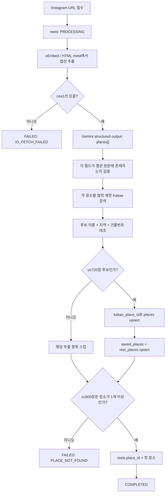
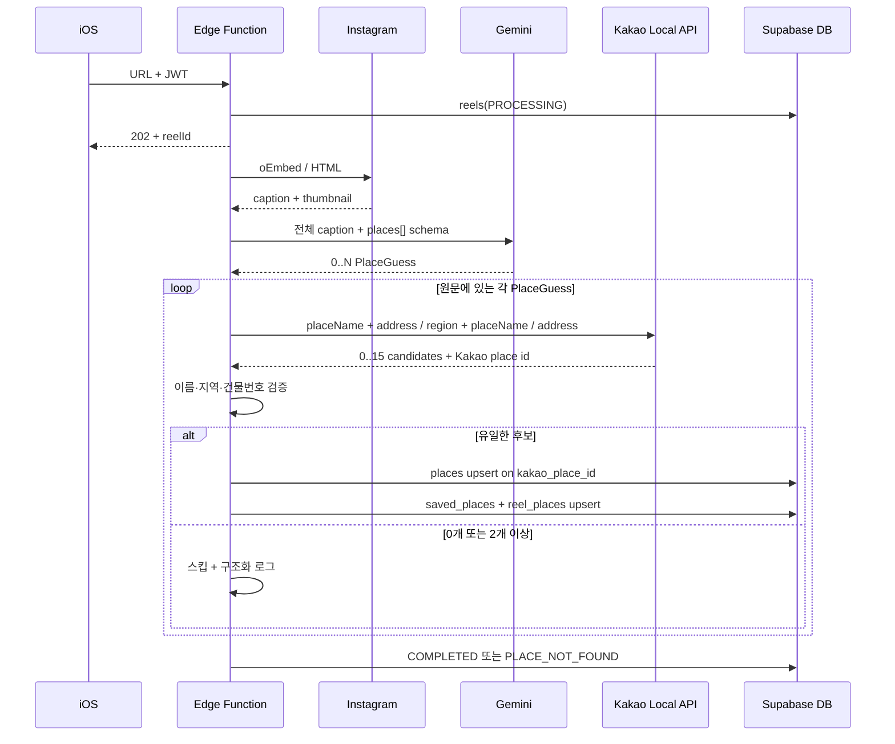

# 여기담 MVP 장소 매칭 및 출시 판단 보고서

- 기준일: 2026-08-10
- 기준 구현: Gemini-first 다중 추출 + Kakao Local API 검증
- 대상: `save-instagram-reel` Edge Function

## 1. 결론

현재 MVP는 캡션 전체를 Gemini에 보내 장소명과 상세 주소를 다중 추출한 뒤, Kakao Local API 후보의 이름과 주소를 원문과 다시 대조한다. 유일하게 검증된 후보만 저장하고, 중복은 Kakao 장소 ID로 막는다.

이 선택의 의미는 다음과 같다.

- `places.id`: 여기담 내부 UUID PK, FK와 사용자 저장 관계에 사용
- `places.kakao_place_id`: Kakao Local API의 외부 자연키, `UNIQUE`
- 이름·주소·좌표: 표시와 후보 검증용, 유일키가 아님
- 정규식: 커버리지 관측과 향후 fallback 연구용, 현재 저장 결정에 사용하지 않음

Kakao 장소 ID는 같은 건물의 층별 매장을 구분할 수 있지만, **잘못된 후보를 골랐다면 그 오탐을 막아주지는 않는다.** 따라서 외부 ID와 후보 검증은 둘 다 필요하다.

## 2. MVP happy case

다음 조건을 만족하면 자동 저장 대상이다.

1. Instagram oEmbed 또는 HTML meta에서 캡션을 읽을 수 있다.
2. 캡션에 실제 장소명과 주소 또는 충분한 지역이 있다.
3. Gemini가 그 문자열을 추론하지 않고 원문 그대로 반환한다.
4. Kakao 키워드 검색에서 이름과 주소가 맞는 후보가 하나만 남는다.

다음은 MVP에서 자동 저장하지 않아도 되는 입력이다.

- 상호 또는 주소가 전혀 없는 릴스
- OCR을 해야만 장소를 알 수 있는 릴스
- `용용선생` 같이 지점 근거 없이 브랜드명만 있는 캡션
- 이름·주소 일치 후보가 두 개 이상인 모호한 캡션

## 3. 전체 플로우



## 4. 시퀀스



## 5. 의사코드

```text
caption = fetchInstagramCaption(url)
regexAddresses = extractAllRoadAddresses(caption)  // shadow log only

rawPlaces = Gemini.extractPlaces(caption, maxItems=10)
guesses = rawPlaces
  .keep(placeName literally appears in caption)
  .keep(address or region literally appears in caption)
  .deduplicate()

matches = []
for guess in guesses:
    queries = unique([
      guess.placeName + guess.address,
      guess.region + guess.placeName,
      guess.address
    ])

    // placeName 단독 전국 검색은 만들지 않음
    candidates = Kakao.keywordSearchAll(queries)
    verified = candidates
      .filter(name matches guess.placeName or valid branch suffix)
      .filter(region tokens match)
      .filter(building number matches when address exists)
      .uniqueBy(kakaoPlaceId)

    if verified.count == 1:
        matches.add(verified.first)

matches = matches.uniqueBy(kakaoPlaceId)
if matches.empty:
    fail(PLACE_NOT_FOUND)

for match in matches:
    place = upsert places on kakao_place_id
    upsert saved_places(user_id, place.id)
    upsert reel_places(reel_id, place.id, caption_order)

complete(reels.place_id = matches.first.internalUuid)
```

## 6. 다중 장소 정책

하나의 릴스에 주소가 여러 개면 하나만 고를 이유가 없다. Gemini 응답은 단일 객체가 아닌 `places[]`이며, 각 항목을 독립적으로 Kakao에서 검증한다.

- 최대 추출: 10개
- 각 장소: 0개 또는 2개 이상 후보면 스킵
- 부분 성공: 적어도 1개가 검증되면 그 장소들은 저장
- 전체 실패: 검증된 장소가 0개면 `PLACE_NOT_FOUND`
- 순서: `reel_places.position`에 캡션 노출 순서 저장
- 호환성: `reels.place_id`는 첫 번째 장소를 계속 가리킴

## 7. 예시

### 보연희

```text
📍보연희
서울 서대문구 연희맛로 17-63 2층
```

Gemini는 상호와 `2층`까지 포함한 주소를 반환한다. Kakao 후보의 이름이 `보연희`이고 도로명 건물번호가 `17-63`이면 해당 Kakao ID를 저장한다. 층수는 `source_address`에 보존된다.

### 키리와 키리엑스

```text
키리
광주 동구 동명동 200-188
```

서울의 `키리엑스`는 이름과 광주 지역이 둘 다 틀리므로 제거된다. Kakao ID가 있다는 이유만으로 저장하지 않는다.

### 같은 건물의 여러 매장

```text
보연희 / 서울 서대문구 연희맛로 17-63 2층
다른카페 / 서울 서대문구 연희맛로 17-63 4층
```

지오코딩 좌표는 같거나 매우 가까울 수 있다. 좌표로 유니크를 걸지 않고, 서로 다른 Kakao 장소 ID와 상호로 두 매장을 구분한다.

### 여러 장소 모음

```text
1. 키리 - 광주 동구 동명동 200-188
2. 보연희 - 서울 서대문구 연희맛로 17-63 2층
```

Gemini가 두 개의 원소를 반환하고, Kakao에서 각각 유일하게 검증되면 `saved_places`에 두 행, `reel_places`에 순서 0과 1로 저장된다.

## 8. 정규식 조사

### 도로명 주소 후보

현재 구현은 다음 형태를 지원한다.

```regex
(?:시·도)\s*(?:시·군·구)\s*(?:대로|로|길)\s*\d+(?:-\d+)?(?:\s+상세주소)*
```

예: `서울 서대문구 연희맛로 17-63 2층`, `경기 성남시 판교역로 12 101동 202호`

### 지번 주소 후보

향후 관측용 정규식은 다음 구조를 기준으로 할 수 있다.

```regex
(?:시·도\s+)?(?:시·군·구\s+)*(?:읍|면|동|가|리)\s+(?:산\s*)?\d+(?:-\d+)?(?:번지)?(?:\s+상세주소)*
```

예: `광주 동구 동명동 200-188`, `제주 제주시 애월읍 곽u남리 산 12-3`

단일 `match()`가 아닌 전역 `matchAll()`로 모든 주소 후보를 노출 순서대로 뽑아야 한다. 현재 `address.ts`의 도로명 관측도 이 방식으로 여러 주소를 반환한다.

### 정규식만으로 부족한 이유

- 시·도 생략, 세종처럼 계층이 다른 행정구역
- `산`, `번지`, 건물명, 괄호 병기, 구주소·신주소 동시 표기
- 상호명에 `로`, `길`, 숫자가 있는 false positive
- 줄바꿈, 특수문자, OCR 오타
- 이전·상호 변경·행정구역 개편

조사한 공개 자료에서도 실제 서비스는 '마법의 정규식 하나'로 주소를 확정하지 않았다.

- [우아한형제들: 정부 도로명주소 데이터 활용](https://techblog.woowahan.com/2608/): 공식 데이터를 수집·가공하는 전체 파이프라인이 필요
- [우아한형제들: 도로명·지번·좌표·법정동 결합](https://techblog.woowahan.com/11238/): 문자열 이외의 공간·행정 데이터가 필요
- [행정안전부 주소정보누리집 DB](https://business.juso.go.kr/addrlink/attrbDBDwld/attrbDBDwldList.do?cPath=99MD&menu=%EB%8F%84%EB%A1%9C%EB%AA%85): 도로명, 관련 지번, 건물·상세주소가 별도 데이터로 제공됨
- [당근: RAG 검색 서비스](https://medium.com/daangn/rag%EB%A5%BC-%ED%99%9C%EC%9A%A9%ED%95%9C-%EA%B2%80%EC%83%89-%EC%84%9C%EB%B9%84%EC%8A%A4-%EB%A7%8C%EB%93%A4%EA%B8%B0-211930ec74a1): 후보 생성과 검증·랭킹을 분리하는 방식이 유효

따라서 MVP에서는 Gemini로 구조화 후보를 쉽게 만들고, Kakao의 장소 DB로 검증한다. 정규식 + 공공주소 DB 검증은 추후 비용 절감과 AI 장애 대응이 필요할 때 도입한다.

## 9. 실패 케이스

| 단계 | 예시 | 현재 결과 |
|---|---|---|
| Instagram | 비공개·삭제·로그인 차단 | `IG_FETCH_FAILED` |
| Gemini | 429, 모델 오류, 잘못된 JSON | 후보 0개, 최종 `PLACE_NOT_FOUND` |
| 원문 검증 | Gemini가 캡션에 없는 지점명 추론 | 필드 제거 또는 항목 스킵 |
| Kakao | REST API 키 누락·오류, 0건 | `PLACE_NOT_FOUND` |
| 후보 검증 | 같은 이름·같은 건물 후보 2개 | 임의 선택 없이 스킵 |
| 다중 장소 | 3개 중 2개만 유일 검증 | 2개만 저장, `COMPLETED` |
| DB | `kakao_place_id` 중복 | 기존 `places` 행 재사용 |
| 썸네일 | Google·Instagram·Kakao 이미지 모두 실패 | 이미지 없이 장소 저장 |

## 10. 출시 게이트

MVP 출시 전 필수 통과 조건은 다음과 같다.

1. 보연희 같은 도로명+상세주소 happy case가 정확한 Kakao ID로 저장됨
2. 키리 지번 주소가 서울 키리엑스로 저장되지 않음
3. 용용선생 브랜드명만 있는 캡션이 임의 지점으로 저장되지 않음
4. 여러 장소 캡션에서 검증된 전체 장소가 `reel_places`에 순서대로 저장됨
5. 같은 Kakao ID를 두 번 저장해도 `places`/`saved_places`가 중복되지 않음
6. 신규 행의 카카오맵 버튼이 해당 장소 ID 페이지를 열고, 레거시 행은 이름+주소 검색을 염

이 게이트를 통과하면 happy case MVP로 출시 가능하다. OCR, 사용자 후보 선택 UI, 공공주소 DB, 이전·폐업 동기화는 출시 후 확장 범위다.
