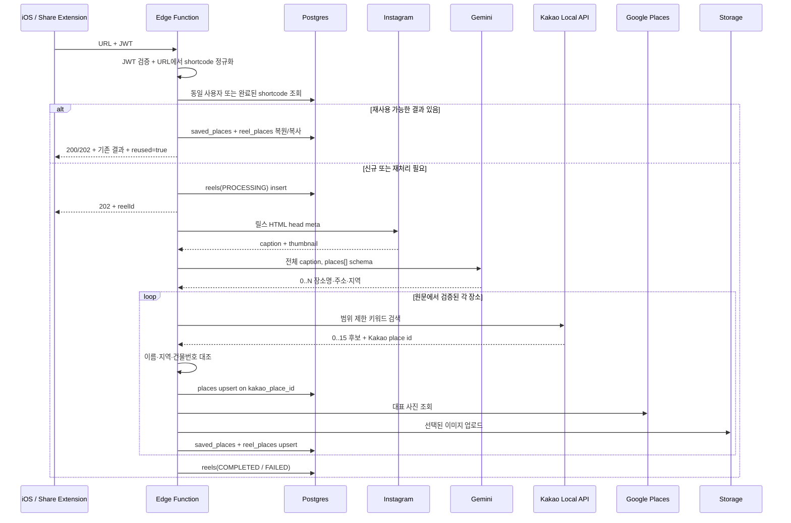

# 릴스 장소 저장 구현 플로우

- 엔드포인트: `POST /functions/v1/save-instagram-reel`
- 구현: `supabase/functions/save-instagram-reel`
- 처리: 접수는 동기, 장소 추출·저장은 비동기
- 장소 자연키: Kakao Local API `id`

## 1. 요청 계약

```http
POST /functions/v1/save-instagram-reel
Authorization: Bearer <Supabase user JWT>
apikey: <Supabase anon key>
Content-Type: application/json
```

```json
{
  "instagramUrl": "https://www.instagram.com/reel/SHORTCODE",
  "source": "instagram_share"
}
```

신규 접수는 `202`와 `reelId`를 반환한다. 이미 완료된 동일 릴스 결과를 재사용한 경우에는 `200`, `status: COMPLETED`, `reused: true`, `placeIds`를 바로 반환한다.

## 2. 전체 순서



## 3. Instagram 추출

1. 캡션: HTML `og:description` → `name="description"` → `twitter:description`
2. 보조 저장: `og:image`, `og:url`

릴스 URL의 HTML head가 유일한 캡션 입력이자 SSOT다. HTML 태그 배치 순서와 무관하게 위 description 우선순위를 적용하고, 큰따옴표·작은따옴표를 모두 처리하며 HTML entity를 디코딩한다. 한 번의 릴스 HTML 요청에서 description을 얻지 못하면 추가 Instagram 요청 없이 `IG_FETCH_FAILED`다.

Gemini 입력과 DB의 캡션 원문은 선택된 description 하나다. `og:title`과 `twitter:title`은 파싱하거나 저장하지 않는다. title과 description에 같은 전체 캡션이 반복되는 Instagram 응답에서 불필요한 데이터 보관과 중복 입력 가능성을 없앤다. 릴스 HTML 요청이 non-2xx이거나 description이 없으면 Gemini를 호출하지 않는다.

레거시 스키마의 `reels.instagram_title` 컬럼은 기존 배포 호환을 위해 당분간 nullable 상태로 남겨 두지만 신규 처리와 동일 릴스 결과 재사용에서는 값을 쓰지 않는다. UI, 장소 매칭, 중복 판정, 재시도 어느 경로에서도 사용하지 않으며 다음 스키마 정리 때 제거할 수 있다.

## 4. Gemini-first 다중 추출

캡션 전체를 structured output으로 보낸다.

```json
{
  "places": [
    {
      "placeName": "보연희",
      "address": "서울 서대문구 연희맛로 17-63 2층",
      "addressType": "ROAD",
      "region": "연희동"
    }
  ]
}
```

- 현재 최대 10개. Gemini 제약이 아니라 후속 호출량을 제한하는 MVP 안전 상한
- 여러 주소·장소는 별도 원소
- 같은 장소의 도로명·지번 병기는 하나로 통합
- 층·동·호를 포함한 상세주소 보존
- 이름·주소·지역은 추론하지 않고 원문 문자열 복사

호출 후 각 필드가 실제로 캡션에 있는지 다시 검증한다. 장소명만 있고 주소·지역 근거가 없으면 제거한다.

상한은 response schema의 `maxItems: 10`과 파서의 `slice(0, 10)` 양쪽에 적용된다. 캡션에 11개 이상 장소가 있어도 응답에 포함된 10개 중 하나가 저장되면 최종 상태는 `COMPLETED`이며, 이후 장소가 잘렸다는 경고는 현재 응답과 DB에 없다. 따라서 응답에 포함되지 않은 항목은 Gemini 이후의 Kakao 단계에 도달하지 않는다.

현재 프롬프트는 원문 순서대로 반환하라고 명시하지 않는다. `reel_places.position`도 원문 절대 인덱스가 아니라 검증에 성공한 결과를 0부터 다시 센 순서다. 원문 1·3·5번째만 성공하면 position은 0·1·2가 된다.

장소 수가 늘어도 Gemini 호출은 캡션당 한 번이다. 비용과 지연은 주로 각 결과에 대한 Kakao 검색, 새 장소의 Google 사진 조회, Storage 업로드에서 증가한다.

`address.ts`는 캡션의 도로명 주소를 `matchAll()`로 모두 수집하지만 현재는 shadow log에만 사용한다.

## 5. Kakao 후보 생성과 검증

각 `PlaceGuess`에서 다음 쿼리를 생성한다.

1. `장소명 + 주소`
2. `지역 + 장소명`
3. `주소`

`장소명` 단독 전국 검색은 임의 지점 저장을 막기 위해 사용하지 않는다. Kakao는 쿼리당 정확도순 최대 15개를 반환한다.

현재 장소와 쿼리는 순차 처리한다. 한 장소에서 세 쿼리가 모두 만들어질 수 있으므로 10개 상한은 Kakao 키워드 검색 최대 30회를 뜻한다. 주소 없는 `지역 + 장소명` 항목은 보통 한 쿼리만 만들기 때문에 실제 호출 수는 캡션 구성에 따라 작아진다.

후보는 다음 조건을 모두 통과해야 한다.

- 이름 정규화 후 정확히 같음
- 또는 `종각점`, `본점`, `2호점`, `관`, `센터` 같은 유효한 지점 접미사만 덧붙음
- 시·도·시·군·구·동 토큰이 후보 주소와 일치
- 출처 주소에 건물번호가 있으면 Kakao 도로명 또는 지번 주소와 일치

캡션과 Kakao 상호명이 한 글자만 다른 경우에는 이름이 4글자 이상이고 주소 근거가 강할 때만 오타로 보정한다. 도로명·건물번호가 같거나, 도로명 숫자의 인접 두 자리가 뒤바뀐 경우까지 허용한다. 다른 도로·건물번호, 지역 근거만 있는 후보는 이 보정을 적용하지 않는다.

중복 제거 후 후보가 하나일 때만 확정한다. 0개나 2개 이상이면 해당 추출 항목을 스킵한다.

## 6. 저장과 중복

`places.kakao_place_id` 유니크 제약으로 upsert한다.

- `places.id`: 내부 UUID
- `kakao_place_id`: 외부 자연키
- `kakao_place_url`: `https://map.kakao.com/link/map/{id}`
- `source_address`: Instagram 원문의 상세주소
- `road_address`, `address`, 좌표, 전화, 카테고리: Kakao 정규화 결과

`saved_places(user_id, place_id)`는 사용자별 중복을 막고, `reel_places(reel_id, place_id, position)`는 하나의 릴스와 여러 장소 관계를 보존한다. `position`은 성공한 Gemini 결과의 상대 순서다. 기존 앱 호환을 위해 `reels.place_id`는 첫 장소를 계속 가리킨다.

인증 사용자는 `reel_places`를 임의로 쓰지 못한다. 다만 장소 상세의 관련 릴스를 조회할 수 있도록, RLS가 현재 사용자의 `reels.user_id`와 연결된 관계에 한해서 읽기를 허용한다. iOS는 이 관계로 완료된 릴스를 최신순 조회하고 썸네일을 누르면 원본 `instagram_url`을 연다.

`reels.instagram_shortcode`는 Instagram 콘텐츠 식별자다. `(user_id, instagram_shortcode)` partial unique index로 같은 사용자의 동시 중복 요청을 한 행으로 수렴시킨다.

- 같은 사용자의 `PROCESSING` 또는 `COMPLETED`: 기존 `reelId`와 상태 반환
- 다른 사용자의 같은 shortcode가 현재 알고리즘 버전으로 완료됨: 장소 관계와 저장 목록만 복사하고 외부 API 생략
- `FAILED`, 15분 이상 갱신되지 않은 작업, 낮은 `processing_version`: 같은 행을 비우고 재처리
- 완료된 릴스의 저장 장소를 사용자가 삭제한 뒤 다시 저장: 기존 `reel_places`에서 `saved_places` 복원

장소 매칭 결과가 달라지는 코드를 배포할 때 `PIPELINE_VERSION`을 올리지 않으면 완료된 같은 shortcode는 기존 결과를 계속 재사용한다. 반대로 버전을 올리면 재처리되지만, 현재 정리는 `reel_places`만 대상으로 하고 사용자 단위 `saved_places`는 자동 삭제하지 않는다. 과거 오탐을 제거하려면 다른 릴스가 같은 장소를 참조하는지 확인하는 별도 정리 정책이 필요하다.

Naver 전용 `naver_place_id`, `naver_link`, `naver_thumbnail_url`은 Kakao 전환 마이그레이션에서 제거한다. 장소 식별자와 지도 링크의 SSOT는 각각 `kakao_place_id`, `kakao_place_url`이다.

`places.source_address`는 공용 장소 행에 저장되므로 릴스별 주소 이력이 아니다. 같은 Kakao 장소가 다른 캡션의 상세주소로 다시 저장되면 최근 non-null 원문 주소로 바뀔 수 있다. 릴스별 원문 보존이 필요하면 `reel_places`에 별도 컬럼을 두어야 한다.

다중 장소 저장은 현재 하나의 Postgres 트랜잭션으로 묶이지 않는다. 앞 장소의 `places`·`saved_places`·`reel_places` 저장 후 뒤 장소에서 DB 오류가 발생하면 릴스는 `FAILED/UNKNOWN`이지만 앞선 쓰기가 남을 수 있다.

## 7. 썸네일

1. `places.thumbnail_url` 캐시
2. DB 월간 예약 한도 통과 후 Google Places 사진
3. Instagram `og:image`
4. Kakao 장소 상세 페이지 `og:image`
5. 모두 실패하면 앱 placeholder

외부 URL을 그대로 보관하지 않고 `place-thumbnails` Storage에 업로드한다.

## 8. 상태

| 상태 | 의미 |
|---|---|
| `PROCESSING` | 접수 후 백그라운드 처리 중 |
| `COMPLETED` | 검증된 장소가 1개 이상 저장됨 |
| `FAILED` | 구조화 또는 저장 실패 |

| 실패 사유 | 대표 원인 |
|---|---|
| `IG_FETCH_FAILED` | Instagram 차단·메타데이터 없음 |
| `PLACE_NOT_FOUND` | Gemini/Kakao 키 누락, 추출 0개, Kakao 0건, 유일 후보 없음 |
| `UNKNOWN` | DB·Storage 또는 예상하지 못한 예외 |

`COMPLETED`가 모든 캡션 장소의 저장을 보장하지는 않는다. 다음은 실패 상태가 아닌 부분 성공이다.

- 10개 상한 때문에 Gemini 응답에서 제외된 장소가 처리되지 않음
- 여러 Gemini 항목 중 일부만 Kakao에서 유일 후보로 검증됨
- 동일 Kakao 장소 ID가 캡션에 반복되어 하나로 합쳐짐
- 썸네일 제공자가 모두 실패하여 이미지 없이 장소만 저장됨

운영에서 저장 개수가 예상보다 적으면 `instagram_description`의 장소 순서, Gemini `placeCount`, sanitized count, 장소별 Kakao `verifiedCount`, 최종 `reel_places.position`을 차례로 확인한다.

상세 알고리즘, 정규식 조사, 실패 매트릭스는 [MVP 장소 매칭 보고서](mvp-place-matching-release-report.md)를 참고한다.
