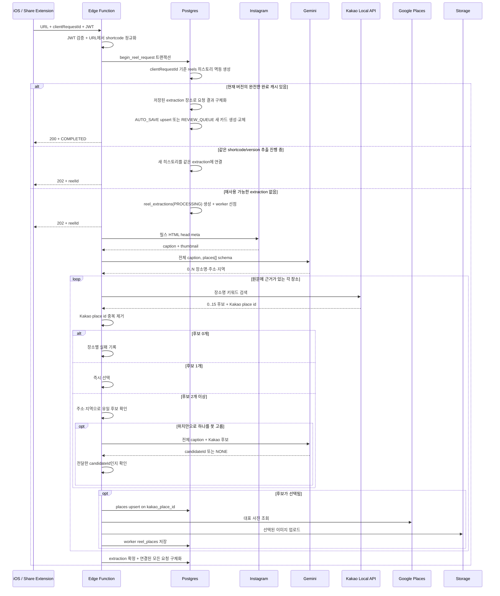

# 릴스 장소 저장 구현 플로우

- 엔드포인트: `POST /functions/v1/save-instagram-reel` (`AUTO_SAVE`), `POST /functions/v1/save-instagram-reel-v2` (`REVIEW_QUEUE`)
- 구현: `supabase/functions/save-instagram-reel`
- 처리: 접수는 동기, 장소 추출·저장은 비동기
- 장소 자연키: Kakao Local API `id`

## 1. 요청 계약

```http
POST /functions/v1/save-instagram-reel
Authorization: Bearer <Supabase user JWT>
apikey: <Supabase anon key>
Content-Type: application/json
```

```json
{
  "instagramUrl": "https://www.instagram.com/reel/SHORTCODE",
  "source": "instagram_share",
  "clientRequestId": "6d8c1b73-5be1-4c29-9241-5da0b829e81a"
}
```

클라이언트는 사용자가 명시적으로 공유하거나 URL을 입력할 때마다 새 `clientRequestId` UUID를 만들고, 응답을 확신할 수 없는 네트워크 재시도에는 같은 값을 유지한다. `(user_id, request_id)`가 유일하므로 같은 ID의 재전송은 같은 `reels` 히스토리로 수렴하고 대기함 순서나 저장 시각도 다시 갱신하지 않는다. 반대로 같은 릴스라도 새 ID로 보낸 명시적 재요청은 별도의 `reels` 히스토리를 만든다. 구버전 클라이언트가 ID를 보내지 않으면 서버가 호환용 UUID를 생성하지만, 클라이언트 재시도 간 멱등성은 보장할 수 없다.

새 추출을 시작하거나 진행 중인 공용 추출에 합류하면 `202`와 `reelId`를 반환한다. 현재 파이프라인 버전의 완료 캐시를 즉시 재사용하면 `200`, `status: COMPLETED`, `placeIds`를 반환한다. 화면은 신규 추출과 캐시 재사용을 구분해 표시하지 않는다.

## 2. 전체 순서



## 3. Instagram 추출

1. 캡션: HTML `og:description` → `name="description"` → `twitter:description`
2. 보조 저장: `og:image`, `og:url`

릴스 URL의 HTML head가 유일한 캡션 입력이자 SSOT다. HTML 태그 배치 순서와 무관하게 위 description 우선순위를 적용하고, 큰따옴표·작은따옴표를 모두 처리하며 HTML entity를 디코딩한다. 한 번의 릴스 HTML 요청에서 description을 얻지 못하면 추가 Instagram 요청 없이 `IG_FETCH_FAILED`다.

Gemini 입력과 DB의 캡션 원문은 선택된 description 하나다. `og:title`과 `twitter:title`은 파싱하거나 저장하지 않는다. title과 description에 같은 전체 캡션이 반복되는 Instagram 응답에서 불필요한 데이터 보관과 중복 입력 가능성을 없앤다. 릴스 HTML 요청이 non-2xx이거나 description이 없으면 Gemini를 호출하지 않는다.

레거시 스키마의 `reels.instagram_title` 컬럼은 기존 배포 호환을 위해 당분간 nullable 상태로 남겨 두지만 신규 처리와 동일 릴스 결과 재사용에서는 값을 쓰지 않는다. UI, 장소 매칭, 중복 판정, 재시도 어느 경로에서도 사용하지 않으며 다음 스키마 정리 때 제거할 수 있다.

## 4. Gemini-first 다중 추출

캡션 전체를 structured output으로 보낸다.

```json
{
  "places": [
    {
      "placeName": "보연희",
      "address": "서울 서대문구 연희맛로 17-63 2층",
      "addressType": "ROAD",
      "region": "연희동"
    }
  ]
}
```

- 애플리케이션이 장소 개수를 제한하지 않고 Gemini가 반환한 유효 항목을 모두 처리
- 여러 주소·장소는 별도 원소
- 같은 장소의 도로명·지번 병기는 하나로 통합
- 층·동·호를 포함한 상세주소 보존
- 이름·주소·지역은 추론하지 않고 원문 문자열 복사

호출 후 각 필드가 실제로 캡션에 있는지 다시 검증한다. 장소명이 원문에 없으면 항목을 제거하고, 주소·지역이 원문에 없으면 해당 필드만 `null`로 둔다. 주소와 지역이 모두 없어도 원문에 실제 방문 장소로 언급된 장소명은 후속 Kakao 검색에 넘긴다.

response schema와 응답 파서에는 장소 개수 상한을 두지 않는다. Gemini가 반환한 모든 유효 장소가 후속 Kakao 단계에 들어가며, 2차 후보 선택도 전체 대상 장소의 판단을 파싱한다. 다만 모델의 출력 토큰·컨텍스트 같은 공급자 한계나 모델 자체 누락 가능성까지 없어지는 것은 아니다.

현재 프롬프트는 원문 순서대로 반환하라고 명시하지 않는다. `reel_places.position`도 원문 절대 인덱스가 아니라 최종 매칭에 성공한 결과를 0부터 다시 센 순서다. 원문 1·3·5번째만 성공하면 position은 0·1·2가 된다.

1차 장소 추출 Gemini는 캡션당 한 번 호출한다. 복수 Kakao 후보가 남은 장소가 있으면 해당 장소들을 묶어 2차 후보 선택 Gemini를 최대 한 번 추가 호출한다. 비용과 지연은 주로 각 결과에 대한 Kakao 검색, 필요한 2차 Gemini 판단, 새 장소의 Google 사진 조회, Storage 업로드에서 증가한다.

`address.ts`는 캡션의 도로명 주소를 `matchAll()`로 모두 수집하지만 현재는 shadow log에만 사용한다.

## 5. Kakao 후보 생성과 선택

각 `PlaceGuess`는 주소·지역 유무와 관계없이 `장소명` 하나로 Kakao 키워드 검색을 한 번 호출한다. 주소 문자열을 검색어에 섞거나, 결과가 없을 때 장소명으로 다시 검색하는 fallback은 없다. Kakao 응답은 정확도순 최대 15개이며, 같은 Kakao place id가 반복되면 첫 결과만 남긴다.

HTTP 200 응답의 `documents: []`만 실제 후보 0개로 처리한다. Kakao가 401·403·429·5xx를 반환하거나 네트워크·응답 형식 오류가 발생하면 후보 0개로 바꾸지 않고 공급자 오류로 중단한다. 현재 별도 DB 실패 enum을 늘리지 않고 재시도 가능한 `UNKNOWN`으로 기록하며, `kakao_place_search_failed` 로그에 오류 종류·HTTP status·재시도 가능 여부를 남긴다.

후보 선택 정책은 다음과 같다.

| Kakao place id 중복 제거 후 후보 수 | 처리 |
|---|---|
| 0개 | 해당 장소를 `NO_KAKAO_CANDIDATE`로 기록하고 저장하지 않음 |
| 1개 | 이름·주소를 다시 비교하지 않고 즉시 `AUTO_MATCH` |
| 2개 이상 | 캡션에서 추출한 주소·지역으로 정확히 하나만 특정되면 `AUTO_MATCH`; 그 외에는 원본 후보 전체를 2차 Gemini에 전달 |

복수 후보의 위치 자동 선택은 **양성 일치**에만 쓴다. 파싱 가능한 행정구역 토큰, 도로명, 건물번호가 후보 주소와 정확히 맞아 하나만 남을 때만 자동 선택한다. 불완전하거나 파싱할 수 없는 위치, 일치 후보 0개, 일치 후보 2개 이상은 후보를 버리는 근거가 아니라 2차 Gemini로 넘기는 조건이다.

2차 Gemini는 전체 캡션과 최대 15개의 Kakao 후보를 함께 받는다. `@아이디`, 해시태그, 지점명, 지역 문맥, 한글·영문·음차·철자 차이를 종합해 전달된 `candidateId` 하나를 선택하거나 근거가 부족하면 `NONE`을 반환한다. 코드의 최종 가드는 Gemini가 새 장소를 만들어 내지 못하도록 선택 ID가 전달 후보 목록에 있는지만 확인하며, 이름이나 주소 규칙으로 그 판단을 다시 뒤집지 않는다.

이전의 상호명 지점 접미사 규칙, 4글자 이상 한 글자 오타 규칙, 도로명 숫자 전치 허용, 상세주소 기반 장소명-only fallback, Gemini 선택 후 이름·다지역·도로·건물번호 재검증은 제거했다. 표기 차이와 문맥 판단은 2차 Gemini가 맡는다.

현재 장소는 순차 처리하며, Gemini가 추출한 장소마다 Kakao 키워드 검색을 한 번 호출한다. 애플리케이션 개수 상한이 없으므로 요청 수는 추출 장소 수에 비례한다.

## 6. 저장과 중복

`places.kakao_place_id` 유니크 제약으로 upsert한다.

- `places.id`: 내부 UUID
- `kakao_place_id`: 외부 자연키
- `kakao_place_url`: `https://map.kakao.com/link/map/{id}`
- `source_address`: Instagram 원문의 상세주소
- `road_address`, `address`, 좌표, 전화, 카테고리: Kakao 정규화 결과

`reels`는 추출 결과 자체가 아니라 사용자 요청 히스토리다. 사용자가 명시적으로 다시 공유하면 같은 사용자·shortcode라도 새 행이 생기고, 네트워크 재전송만 같은 `clientRequestId`로 한 행에 수렴한다. 각 요청은 `extraction_id`로 공용 추출 attempt를 참조하며 기존 앱 호환을 위해 `reels.place_id`는 해당 결과의 첫 장소를 계속 가리킨다.

`reel_extractions`와 `reel_extraction_places`는 사용자와 무관한 추출 결과다. 현재 `PIPELINE_VERSION`의 `(instagram_shortcode, pipeline_version)`에 대해 진행 중인 attempt 또는 `COMPLETED/cacheable=true`인 완전한 결과 하나만 활성 캐시가 된다. 같은 사용자든 다른 사용자든 완료 결과가 있으면 Instagram·Gemini·Kakao를 다시 호출하지 않고 저장된 장소 목록을 사용하며, 동시에 들어온 요청도 한 worker에 합류한다. 알려진 장소 매칭 실패가 섞인 부분 성공은 `COMPLETED/cacheable=false`, 전체 실패는 `FAILED/cacheable=false`로 보존하므로 다음 명시적 요청은 새 extraction을 만들어 다시 추출한다.

`REVIEW_QUEUE` 대기함은 요청 히스토리와 분리된 사용자별 `reel_queue_batches`·`reel_queue_items`다.

- 같은 사용자의 같은 shortcode에 미처리(open) batch가 있어도 재공유가 성공하면 기존 batch와 item을 물리 삭제하고, 릴스의 전체 장소를 새 `PENDING` item으로 담은 batch를 생성한다. 새 batch는 실제 생성 시각인 `created_at DESC, id DESC` 순서로 상단에 보인다. 완료 cache를 재사용하면 즉시 교체하고, 새 추출이 필요하면 추출 성공 시에만 삭제와 생성을 한 트랜잭션으로 수행한다. 따라서 추출 중이거나 실패하면 기존 카드는 그대로 남고, 재공유 전 item ID로 늦게 도착한 저장 요청은 새 카드를 변경하지 못한다. 재공유만으로는 `saved_places.last_saved_at`도 바뀌지 않는다.
- 모든 item을 저장하거나 버리면 batch에 `resolved_at`을 기록한다. 이후 같은 릴스를 다시 공유하면 새 batch와 item을 만든다.
- 명시적 재공유는 open batch 유무와 관계없이 언제나 새 `reels` 히스토리를 남긴다.

`saved_places(user_id, place_id)`는 사용자별 장소를 한 행으로 유지한다. 처음 저장하면 행을 만들고 이미 있으면 행을 추가하지 않은 채 `last_saved_at = now()`로 갱신한다. 보관함 조회는 `last_saved_at DESC, id DESC`이므로 재저장한 장소가 상단으로 이동한다. 공용 extraction worker의 `AUTO_SAVE`는 장소를 처리할 때마다 사용자 보관함에 쓰지 않고, extraction을 확정하는 한 트랜잭션에서 연결된 요청의 장소를 한꺼번에 upsert한다.

`reel_places(reel_id, place_id, position)`는 extraction worker의 중간 결과와 구버전 호환 관계를 보존한다. `position`은 성공한 Gemini 결과의 상대 순서이며, 완료 후 재사용할 공용 목록은 `reel_extraction_places`에 고정된다.

인증 사용자는 추출·대기함 관계를 임의로 쓰지 못하고, RLS를 통해 자신이 요청한 extraction과 자신의 batch/item만 읽는다. iOS의 장소 상세는 `user_related_reels` 뷰로 같은 shortcode의 반복 히스토리를 하나로 정리해 최신 관련 릴스를 보여주며, 썸네일을 누르면 원본 `instagram_url`을 연다.

구버전 React Native 앱(`fe-release/1.0.1`)의
`reels?select=...,reel_places!inner(place_id)&reel_places.place_id=eq.<placeId>`
요청도 같은 `user_related_reels` 결과를 사용한다. DB의
`public.reel_places(public.reels)` computed relationship이 기존 embedding을
덮어쓰므로 앱의 URL·필터·응답 필드는 바뀌지 않는다. 부모 `reels`에서 읽는
작성자·캡션·썸네일도 그대로 유지한다. 반환형은 `SETOF user_related_reels`이며
이 호환 계약의 중첩 선택 필드는 `place_id`다. 물리 `reel_places` 행 ID나 대기함
item ID를 합성하지 않으며, 기존 테이블에 연결을 복제하거나 worker의 중간
결과를 지우지 않는다. 따라서 재공유 중복 제거와 stale attempt 제외도 새
조회와 같은 기준을 따른다.

이 함수는 호출자 권한으로 실제 부모 행과 소유자를 다시 확인한다. 요청에서
넘긴 composite의 `user_id`나 `extraction_id`는 신뢰하지 않는다. 독립적인
`/rest/v1/reel_places` 조회와 서버의 worker 쓰기에는 영향을 주지 않는다.
이전 `extraction_id IS NULL` 자료는 뷰의 legacy 경로로 계속 조회한다.

장소 매칭 결과가 달라지는 코드를 배포할 때 `PIPELINE_VERSION`을 올리지 않으면 완료된 같은 shortcode는 기존 결과를 계속 재사용한다. 반대로 버전을 올리면 새 extraction을 만들고 과거 extraction과 요청 히스토리는 그대로 보존한다. 사용자 단위 `saved_places`도 자동 삭제하지 않으므로 과거 오탐을 제거하려면 다른 릴스가 같은 장소를 참조하는지 확인하는 별도 정리 정책이 필요하다.

Naver 전용 `naver_place_id`, `naver_link`, `naver_thumbnail_url`은 Kakao 전환 마이그레이션에서 제거한다. 장소 식별자와 지도 링크의 SSOT는 각각 `kakao_place_id`, `kakao_place_url`이다.

`places.source_address`는 공용 장소 행에 저장되므로 릴스별 주소 이력이 아니다. 같은 Kakao 장소가 다른 캡션의 상세주소로 다시 저장되면 최근 non-null 원문 주소로 바뀔 수 있다. 릴스별 원문 보존이 필요하면 extraction 관계에 별도 컬럼을 두어야 한다.

추출 중 `places`·worker `reel_places`·Storage 쓰기는 단계별로 일어나므로 실패한 attempt가 공용 장소나 중간 관계를 일부 남길 수 있다. 다만 재사용 캐시 확정과 새 흐름의 `AUTO_SAVE` 보관함 반영은 `finalize_reel_extraction` 트랜잭션에서 함께 처리되어 사용자 보관함에 부분 결과를 공개하지 않는다.

## 7. 썸네일

1. `places.thumbnail_url` 캐시
2. DB 월간 예약 한도 통과 후 Google Places 사진
3. Instagram `og:image`
4. Kakao 장소 상세 페이지 `og:image`
5. 모두 실패하면 앱 placeholder

외부 URL을 그대로 보관하지 않고 `place-thumbnails` Storage에 업로드한다.

## 8. 상태

| 상태 | 의미 |
|---|---|
| `PROCESSING` | 접수 후 백그라운드 처리 중 |
| `COMPLETED` | 장소가 1개 이상 매칭되어 공용 추출 결과와 사용자별 반영이 완료됨 |
| `FAILED` | 구조화 또는 저장 실패 |

| 실패 사유 | 대표 원인 |
|---|---|
| `IG_FETCH_FAILED` | Instagram 요청 실패 또는 non-2xx 응답 |
| `IG_CAPTION_NOT_FOUND` | HTML 응답은 성공했지만 description 메타데이터 없음 |
| `PROVIDER_CONFIG_MISSING` | Gemini 또는 Kakao API 키 누락 |
| `GEMINI_PLACE_NOT_FOUND` | Gemini 결과가 없거나 원문 검증 후 후보가 0개 |
| `KAKAO_PLACE_NOT_FOUND` | Kakao 후보가 없거나 2차 Gemini가 선택하지 않아 저장할 장소가 0개 |
| `PLACE_NOT_FOUND` | 이전 버전 호환용 일반 장소 탐색 실패 |
| `UNKNOWN` | DB·Storage 또는 예상하지 못한 예외 |

`COMPLETED`가 모든 캡션 장소의 저장을 보장하지는 않는다. 확인된 일부 Kakao 매칭 실패를 포함한 완료 결과는 `cacheable=false`라 다음 명시적 요청에서 재추출한다. 다음은 실패 상태가 아닌 부분 성공 또는 공급자 특성상 감지하기 어려운 누락이다.

- Gemini 모델이 캡션의 일부 장소를 응답에서 누락함
- 여러 Gemini 항목 중 일부만 Kakao 후보 선택에 성공함
- 동일 Kakao 장소 ID가 캡션에 반복되어 하나로 합쳐짐
- 썸네일 제공자가 모두 실패하여 이미지 없이 장소만 저장됨

운영에서 저장 개수가 예상보다 적으면 `instagram_description`의 장소 순서, Gemini `placeCount`, sanitized count, 장소별 Kakao `candidateCount`·`decision`, 2차 Gemini의 `NONE` 사유, 최종 `reel_places.position`을 차례로 확인한다.

상세 알고리즘, 정규식 조사, 실패 매트릭스는 [MVP 장소 매칭 보고서](mvp-place-matching-release-report.md)를 참고한다.
