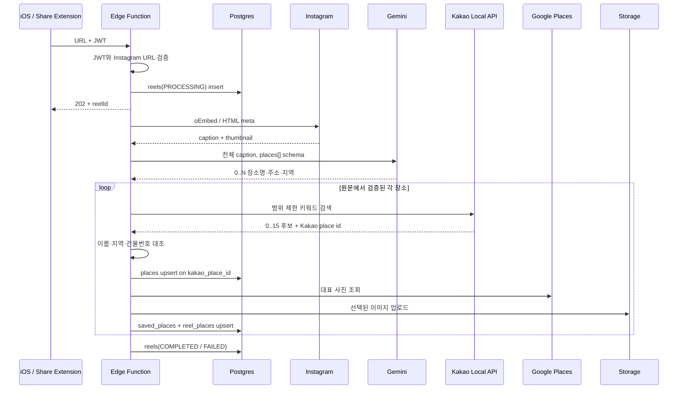

# 릴스 장소 저장 구현 플로우

- 엔드포인트: `POST /functions/v1/save-instagram-reel`
- 구현: `supabase/functions/save-instagram-reel`
- 처리: 접수는 동기, 장소 추출·저장은 비동기
- 장소 자연키: Kakao Local API `id`

## 1. 요청 계약

```http
POST /functions/v1/save-instagram-reel
Authorization: Bearer <Supabase user JWT>
apikey: <Supabase anon key>
Content-Type: application/json
```

```json
{
  "instagramUrl": "https://www.instagram.com/reel/SHORTCODE",
  "source": "instagram_share"
}
```

정상 접수는 `202`와 `reelId`를 반환한다. 이는 최종 저장 성공이 아니라 백그라운드 처리 시작을 뜻한다.

## 2. 전체 순서



## 3. Instagram 추출

1. oEmbed JSON의 `title`, `thumbnail_url`
2. HTML `og:title`, `og:description`, `name="description"`, `og:image`
3. `/embed/captioned/` HTML Caption

속성 순서와 큰따옴표·작은따옴표를 모두 처리하고 HTML entity를 디코딩한다. 캡션을 얻지 못하면 `IG_FETCH_FAILED`다.

## 4. Gemini-first 다중 추출

캡션 전체를 structured output으로 보낸다.

```json
{
  "places": [
    {
      "placeName": "보연희",
      "address": "서울 서대문구 연희맛로 17-63 2층",
      "addressType": "ROAD",
      "region": "연희동"
    }
  ]
}
```

- 최대 10개
- 여러 주소·장소는 별도 원소
- 같은 장소의 도로명·지번 병기는 하나로 통합
- 층·동·호를 포함한 상세주소 보존
- 이름·주소·지역은 추론하지 않고 원문 문자열 복사

호출 후 각 필드가 실제로 캡션에 있는지 다시 검증한다. 장소명만 있고 주소·지역 근거가 없으면 제거한다.

`address.ts`는 캡션의 도로명 주소를 `matchAll()`로 모두 수집하지만 현재는 shadow log에만 사용한다.

## 5. Kakao 후보 생성과 검증

각 `PlaceGuess`에서 다음 쿼리를 생성한다.

1. `장소명 + 주소`
2. `지역 + 장소명`
3. `주소`

`장소명` 단독 전국 검색은 임의 지점 저장을 막기 위해 사용하지 않는다. Kakao는 쿼리당 정확도순 최대 15개를 반환한다.

후보는 다음 조건을 모두 통과해야 한다.

- 이름 정규화 후 정확히 같음
- 또는 `종각점`, `본점`, `2호점`, `관`, `센터` 같은 유효한 지점 접미사만 덧붙음
- 시·도·시·군·구·동 토큰이 후보 주소와 일치
- 출처 주소에 건물번호가 있으면 Kakao 도로명 또는 지번 주소와 일치

중복 제거 후 후보가 하나일 때만 확정한다. 0개나 2개 이상이면 해당 추출 항목을 스킵한다.

## 6. 저장과 중복

`places.kakao_place_id` 유니크 제약으로 upsert한다.

- `places.id`: 내부 UUID
- `kakao_place_id`: 외부 자연키
- `kakao_place_url`: `https://map.kakao.com/link/map/{id}`
- `source_address`: Instagram 원문의 상세주소
- `road_address`, `address`, 좌표, 전화, 카테고리: Kakao 정규화 결과

`saved_places(user_id, place_id)`는 사용자별 중복을 막고, `reel_places(reel_id, place_id, position)`는 하나의 릴스와 여러 장소 관계를 보존한다. 기존 앱 호환을 위해 `reels.place_id`는 첫 장소를 계속 가리킨다.

기존 `naver_place_id`, `naver_link`는 레거시 행 호환을 위해 유지하지만 신규 저장에서 사용하지 않는다.

## 7. 썸네일

1. `places.thumbnail_url` 캐시
2. DB 월간 예약 한도 통과 후 Google Places 사진
3. Instagram `og:image`
4. Kakao 장소 상세 페이지 `og:image`
5. 모두 실패하면 앱 placeholder

외부 URL을 그대로 보관하지 않고 `place-thumbnails` Storage에 업로드한다.

## 8. 상태

| 상태 | 의미 |
|---|---|
| `PROCESSING` | 접수 후 백그라운드 처리 중 |
| `COMPLETED` | 검증된 장소가 1개 이상 저장됨 |
| `FAILED` | 구조화 또는 저장 실패 |

| 실패 사유 | 대표 원인 |
|---|---|
| `IG_FETCH_FAILED` | Instagram 차단·메타데이터 없음 |
| `PLACE_NOT_FOUND` | Gemini/Kakao 키 누락, 추출 0개, Kakao 0건, 유일 후보 없음 |
| `UNKNOWN` | DB·Storage 또는 예상하지 못한 예외 |

상세 알고리즘, 정규식 조사, 실패 매트릭스는 [MVP 장소 매칭 보고서](mvp-place-matching-release-report.md)를 참고한다.
