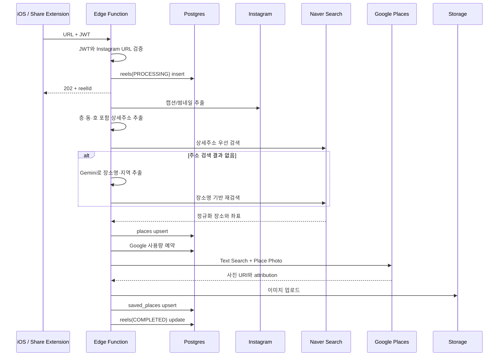

# 릴스 장소 저장 구현 플로우

- 엔드포인트: `POST /functions/v1/save-instagram-reel`
- 구현: `supabase/functions/save-instagram-reel`
- 처리 방식: 접수는 동기, 장소 저장은 비동기

## 1. 요청 계약

```http
POST /functions/v1/save-instagram-reel
Authorization: Bearer <Supabase user JWT>
apikey: <Supabase anon key>
Content-Type: application/json
```

```json
{
  "instagramUrl": "https://www.instagram.com/reel/SHORTCODE",
  "source": "instagram_share"
}
```

`source`는 `instagram_share` 또는 `url_input`입니다. 성공적인 접수 응답은 다음과 같습니다.

```json
{
  "reelId": "uuid",
  "status": "PROCESSING"
}
```

HTTP `202`는 최종 저장 성공이 아니라 비동기 처리 접수를 의미합니다.

## 2. 전체 시퀀스



## 3. 접수 단계

1. `Authorization`의 JWT를 Supabase Auth로 검증합니다.
2. URL이 `instagram.com/reel`, `reels`, `p`, `tv` 형식인지 확인합니다.
3. `service_role` 클라이언트로 `reels` 행을 `PROCESSING` 상태로 생성합니다.
4. `EdgeRuntime.waitUntil()`에 파이프라인을 넘기고 즉시 `202`를 반환합니다.

접수 단계에서 발생 가능한 HTTP 오류:

| 상태 | 응답 | 의미 |
|---|---|---|
| 400 | `invalid_body` | JSON 파싱 실패 |
| 400 | `invalid_instagram_url` | 허용하지 않는 URL |
| 401 | `unauthorized` | JWT 누락·만료·검증 실패 |
| 500 | `db_error` | 최초 `reels` 생성 실패 |

## 4. Instagram 메타데이터 추출

추출 우선순위는 다음과 같습니다.

1. Instagram oEmbed JSON
   - `title`: 전체 캡션
   - `author_name`: 표시용 제목
   - `thumbnail_url`: Instagram 이미지 폴백
2. 일반 HTML `<meta>`
   - `og:title`, `twitter:title`
   - `og:description`, `name="description"`, `twitter:description`
   - `og:image`, `twitter:image`
3. `/embed/captioned/` HTML의 `<div class="Caption">`

HTML 파서는 속성 순서와 작은따옴표·큰따옴표를 모두 처리하며 HTML entity를 디코딩합니다. 세 경로 모두 캡션을 제공하지 못하면 `IG_FETCH_FAILED`입니다.

## 5. 장소 후보 생성

캡션을 얻으면 비용이 낮고 결정적인 주소 검색부터 실행합니다.

1. 한국 도로명 주소와 상세주소 정규식
   - 예: `서울 서대문구 연희맛로 17-63 2층`
   - `B1층`, `지하 1층`, `101동`, `202호`를 함께 보존
2. 추출한 상세주소 전체로 Naver 검색
3. 주소 검색 결과가 없을 때만 Gemini 구조화 추출
   - 이모지 종류나 위치를 장소명 힌트로 사용하지 않음
   - 결과: `{ placeName, region }`
4. Gemini 장소명으로 Naver 재검색

Gemini 이후 Naver 검색 쿼리는 중복을 제거한 뒤 아래 순서로 생성합니다.

1. `지역 + 장소명`
2. `장소명 + 주소`
3. `장소명`

주소만으로 먼저 검색해 성공하면 Gemini는 호출하지 않습니다.

## 6. 장소 정규화와 중복 처리

Naver API HUB 지역 검색의 첫 결과를 다음 필드로 정규화합니다.

> 현재 구현은 최대 5개 후보의 이름·주소 일치도나 모호성을 검증하지 않고 첫 결과를 확정합니다. 따라서 `COMPLETED`는 DB 저장 완료를 뜻할 뿐 장소의 의미상 정확성을 보장하지 않습니다. 확인된 오탐과 출시 전 권장 게이트는 [MVP 장소 매칭 출시 판단 보고서](mvp-place-matching-release-report.md)를 참고합니다.

- Naver place ID 또는 `이름|주소` 폴백 키
- 장소명, 카테고리, 도로명·지번 주소
- Instagram 캡션에서 추출한 층·동·호 포함 `source_address`
- 위도·경도
- Naver 링크와 전화번호

`places.naver_place_id`를 conflict key로 upsert합니다. 같은 장소를 여러 사용자가 저장해도 공용 `places` 행은 재사용됩니다.

장소를 찾지 못하면 `PLACE_NOT_FOUND`, DB upsert가 실패하면 `UNKNOWN`으로 종료합니다.

## 7. 썸네일 선택

장소 행에 이미 `thumbnail_url`이 있으면 외부 API를 호출하지 않고 캐시를 재사용합니다. 없으면 다음 순서입니다.

1. DB RPC `reserve_google_places_thumbnail()`
2. Google Places Text Search로 place와 첫 사진 조회
3. Place Photo media URI 조회
4. 이미지 다운로드 후 `place-thumbnails` Storage 업로드
5. Google 실패 시 Instagram 썸네일 업로드
6. Instagram 실패 시 Naver 장소 페이지 `og:image` 업로드
7. 모두 실패하면 `null`, 앱에서 placeholder 표시

선택 결과는 `places.thumbnail_url`, `thumbnail_source`, `google_place_id`, `photo_attribution`에 저장합니다. 사용자별 `saved_places.thumbnail_url`에도 당시의 대표 URL을 기록합니다.

## 8. 완료와 중복 저장

`saved_places`는 `(user_id, place_id)` conflict를 무시하는 upsert입니다. 같은 사용자가 같은 장소를 다시 저장해도 중복 오류가 발생하지 않습니다.

마지막으로 `reels.place_id`를 연결하고 상태를 `COMPLETED`로 변경합니다.

## 9. 상태와 실패 사유

| 상태 | 설명 |
|---|---|
| `PROCESSING` | 접수 후 백그라운드 처리 중 |
| `COMPLETED` | 장소 매칭과 사용자 저장 완료 |
| `FAILED` | 파이프라인 종료, `failure_reason` 확인 |

| 실패 사유 | 사용자 문구 | 대표 원인 |
|---|---|---|
| `IG_FETCH_FAILED` | 릴스 정보를 가져오지 못했어요 | Instagram 응답 차단·메타데이터 없음 |
| `PLACE_NOT_FOUND` | 장소를 찾지 못했어요 | Naver 검색 결과 없음·필수 키 누락 |
| `UNKNOWN` | 처리 중 문제가 생겼어요 | DB 또는 예상하지 못한 예외 |

## 10. 검증된 실제 사례

릴스 `Db0azgWTF1h`로 프로덕션 파이프라인을 검증했습니다.

```text
결과: COMPLETED
장소: 보연희
도로명 주소: 서울특별시 서대문구 연희맛로 17-63 2층
카테고리: 음식점 > 카페,디저트
썸네일 소스: google_places
Storage 이미지 응답: HTTP 200 image/jpeg
```

이 사례는 `name="description"` 메타 지원과 oEmbed JSON 추출의 회귀 테스트 기준입니다. 장소명 추출은 특정 이모지 형식에 의존하지 않습니다.
