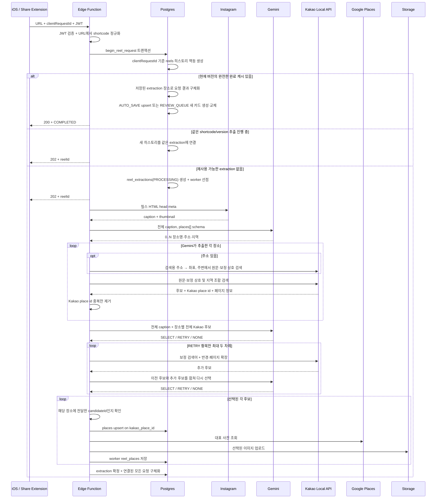

# 릴스 장소 저장 구현 플로우

- 엔드포인트: `POST /functions/v1/save-instagram-reel` (`AUTO_SAVE`), `POST /functions/v1/save-instagram-reel-v2` (`REVIEW_QUEUE`)
- 구현: `supabase/functions/save-instagram-reel`
- 처리: 접수는 동기, 장소 추출·저장은 비동기
- 장소 자연키: Kakao Local API `id`

## 1. 요청 계약

앱↔서버의 기존 v1/v2 엔드포인트, 요청 필드, 응답 필드·타입, HTTP 상태 코드와 오류 형식은 유지한다. `searchNames`, `searchAddress` 등 검색 보조 필드는 서버 내부 AI 호출에서만 사용하며 앱 요청·응답에 추가하지 않는다. `PIPELINE_VERSION`은 서버 내부 추출 캐시 구분값이다.

```http
POST /functions/v1/save-instagram-reel
Authorization: Bearer <Supabase user JWT>
apikey: <Supabase anon key>
Content-Type: application/json
```

```json
{
  "instagramUrl": "https://www.instagram.com/reel/SHORTCODE",
  "source": "instagram_share",
  "clientRequestId": "6d8c1b73-5be1-4c29-9241-5da0b829e81a"
}
```

클라이언트는 사용자가 명시적으로 공유하거나 URL을 입력할 때마다 새 `clientRequestId` UUID를 만들고, 응답을 확신할 수 없는 네트워크 재시도에는 같은 값을 유지한다. `(user_id, request_id)`가 유일하므로 같은 ID의 재전송은 같은 `reels` 히스토리로 수렴하고 대기함 순서나 저장 시각도 다시 갱신하지 않는다. 반대로 같은 릴스라도 새 ID로 보낸 명시적 재요청은 별도의 `reels` 히스토리를 만든다. 구버전 클라이언트가 ID를 보내지 않으면 서버가 호환용 UUID를 생성하지만, 클라이언트 재시도 간 멱등성은 보장할 수 없다.

새 추출을 시작하거나 진행 중인 공용 추출에 합류하면 `202`와 `reelId`를 반환한다. 현재 파이프라인 버전의 완료 캐시를 즉시 재사용하면 `200`, `status: COMPLETED`, `placeIds`를 반환한다. 화면은 신규 추출과 캐시 재사용을 구분해 표시하지 않는다.

## 2. 전체 순서


```mermaid
sequenceDiagram
    participant U as iOS / Share Extension
    participant F as Edge Function
    participant D as Postgres
    participant I as Instagram
    participant AI as Gemini
    participant K as Kakao Local API
    participant G as Google Places
    participant S as Storage

    U->>F: URL + clientRequestId + JWT
    F->>F: JWT 검증 + URL에서 shortcode 정규화
    F->>D: begin_reel_request 트랜잭션
    D->>D: clientRequestId 기준 reels 히스토리 멱등 생성
    alt 현재 버전의 완전한 완료 캐시 있음
        D->>D: 저장된 extraction 장소로 요청 결과 구체화
        D->>D: AUTO_SAVE upsert 또는 REVIEW_QUEUE 새 카드 생성·교체
        F-->>U: 200 + COMPLETED
    else 같은 shortcode/version 추출 진행 중
        D->>D: 새 히스토리를 같은 extraction에 연결
        F-->>U: 202 + reelId
    else 재사용 가능한 extraction 없음
        D->>D: reel_extractions(PROCESSING) 생성 + worker 선점
        F-->>U: 202 + reelId
        F->>I: 릴스 HTML head meta
        I-->>F: caption + thumbnail
        F->>AI: 전체 caption, places[] schema
        AI-->>F: 0..N 장소명·주소·지역
        loop Gemini가 추출한 각 장소
            opt 주소 있음
                F->>K: 검색용 주소 → 좌표, 주변에서 원문·보정 상호 검색
            end
            F->>K: 원문·보정 상호 및 지역 조합 검색
            K-->>F: 후보 + Kakao place id + 페이지 정보
            F->>F: Kakao place id 중복만 제거
        end
        F->>AI: 전체 caption + 장소별 전체 Kakao 후보
        AI-->>F: SELECT / RETRY / NONE
        loop RETRY 항목만 최대 두 차례
            F->>K: 보정 검색어 + 반경·페이지 확장
            K-->>F: 추가 후보
            F->>AI: 이전 후보와 추가 후보를 합쳐 다시 선택
            AI-->>F: SELECT / RETRY / NONE
        end
        loop 선택된 각 후보
            F->>F: 해당 장소에 전달한 candidateId인지 확인
            F->>D: places upsert on kakao_place_id
            F->>G: 대표 사진 조회
            F->>S: 선택된 이미지 업로드
            F->>D: worker reel_places 저장
        end
        F->>D: extraction 확정 + 연결된 모든 요청 구체화
    end
```

## 3. Instagram 추출

1. 모바일 Safari User-Agent로 공개 HTML을 요청한다.
2. 캡션: HTML `og:description` → `name="description"` → `twitter:description`
3. 썸네일: `twitter:image` → `og:image`. 두 태그가 모두 있으면 원본 비율을 유지하는 `twitter:image`를 우선한다.
4. 보조 추출: `og:url`, title/description의 작성자 계정.

Supabase Edge Runtime 1.76.0은 함수가 설정한 User-Agent 뒤에도 실행 엔진·프로젝트 식별값을 자동으로 붙인다. 기존 `Twitterbot/1.0`에 이 접미사가 붙으면 Instagram이 축약 캡션과 가로로 잘린 `og:image`를 반환하는 문제가 재현됐다. 모바일 User-Agent는 같은 접미사가 붙어도 전체 캡션을 받았고, 잘린 응답에서도 `twitter:image`에는 정상 비율 이미지가 남아 있었다. [공식 변경 내역](https://github.com/supabase/edge-runtime/releases/tag/v1.76.0)

릴스 URL의 HTML head가 유일한 캡션 입력이자 SSOT다. HTML 태그 배치 순서와 무관하게 위 description·image 우선순위를 적용하고, 큰따옴표·작은따옴표를 모두 처리하며 HTML entity를 디코딩한다. HTML 요청 실패는 `IG_FETCH_FAILED`, 한 번의 요청에서 description을 얻지 못하면 추가 Instagram 요청 없이 `IG_CAPTION_NOT_FOUND`다.

Gemini 입력과 DB의 캡션 원문은 선택된 description 하나다. `og:title`과 `twitter:title`은 작성자 계정 추출에만 사용하고 캡션으로 저장하거나 AI에 중복 전달하지 않는다. 릴스 HTML 요청이 non-2xx이거나 description이 없으면 Gemini를 호출하지 않는다.

레거시 스키마의 `reels.instagram_title` 컬럼은 기존 배포 호환을 위해 당분간 nullable 상태로 남겨 두지만 신규 처리와 동일 릴스 결과 재사용에서는 값을 쓰지 않는다. UI, 장소 매칭, 중복 판정, 재시도 어느 경로에서도 사용하지 않으며 다음 스키마 정리 때 제거할 수 있다.

## 4. Gemini 추출과 검색용 상호 보정

캡션 전체를 structured output으로 보내 원문과 검색용 표현을 함께 받는다.

```json
{
  "places": [
    {
      "placeName": "버연희",
      "searchNames": ["보연희"],
      "address": "서울 서대문구 연희맛로 17-63 2층",
      "searchAddress": "서울 서대문구 연희맛로 17-63",
      "addressType": "ROAD",
      "region": "연희동"
    }
  ]
}
```

- `placeName`, `address`는 원문의 상호와 상세주소를 보존한다.
- `searchNames`는 오타·음차·영문·약칭·계정명에서 Gemini가 보정한 상호를 최대 3개 담는다. `버연희 → 보연희`, `파파죤스 → 파파존스`는 예시이며 코드의 치환 사전이 아니다. 원문에 없거나 여러 글자가 달라도 검색에 사용할 수 있다.
- `searchAddress`는 도로명 건물번호 또는 지번까지 남긴 주소 검색용 표현이다. `region`은 해당 장소의 지역 문맥을 검색하기 좋은 표현으로 받는다.
- 장소 개수에 애플리케이션 상한을 두지 않는다. 원문 순서로 추출하도록 요청하며, 최종 성공한 장소는 추출 인덱스 순서대로 저장한다.
- 응답 형식은 검사하지만 원문 포함 여부·장소 주변 문자열·지점명 규칙으로 장소나 필드를 삭제하지 않는다. 정규식 주소는 관측용 로그와 로컬 스텁에서만 쓰며 Gemini의 장소·주소 연결을 변경하지 않는다.
- 공급자 공통 JSON schema에는 새 검색 필드를 요구한다. 파서는 이전 형태와의 호환을 위해 검색 필드가 생략된 응답도 받을 수 있다.

1차 추출은 캡션당 한 번이다. 후보 선택은 전체 장소를 묶어 한 번 수행하고, `RETRY` 항목만 최대 두 번 추가 선택한다. 공급자 장애 재시도·fallback을 제외하면 추출 1회 + 선택 최대 3회다.

## 5. Kakao 후보 수집과 Gemini 선택

각 장소는 다음 검색 결과를 합친다.

1. 원문 상호와 `searchNames`의 보정 상호를 모두 검색한다.
2. 지역이 있으면 각 상호에 지역을 붙인 검색도 수행한다.
3. 주소가 있으면 `searchAddress`, 없거나 검색 결과가 없으면 원문 `address`를 Kakao 주소 API로 조회한다. `analyze_type=similar`를 사용하며 건물 이하 상세주소는 제거한다.
4. 주소 검색의 상위 좌표 최대 두 개를 사용해 원문·보정 상호를 반경 500m, 거리순으로 검색한다. 주소 문자열의 정확 일치를 요구하지 않는다.
5. Kakao ID 중복만 제거한다. 단일 후보도 Gemini가 확인하며, 여러 검색에서 모은 후보를 15개로 자르지 않는다. 후보 이름·도로명·지번·카테고리·좌표·검색 중심에서의 거리와 시도한 검색어를 제공한다.

Gemini의 판단은 다음과 같이 처리한다.

| 판단 | 처리 |
|---|---|
| `SELECT` | 해당 장소에 실제 전달한 Kakao ID이면 수용한다. 이름·주소·지점을 코드로 다시 검증하지 않는다. |
| `RETRY` | 보정 검색어 최대 3개를 추가하고 반경을 2km, 다음에는 5km로 확장한다. 키워드와 주변 검색 모두 `is_end`를 확인하며 각각 2, 3페이지까지 확장한다. 이전 후보와 새 후보를 합쳐 Gemini에게 다시 선택시킨다. |
| `NONE` | 장소별 실패 사유를 기록한다. |

검색어는 공백·중복·빈 문자열·80자 길이 제한만 처리한다. 원문 포함 여부, 한 글자 오타, 로마자 변환, 지점 접미사 같은 의미 검증을 하지 않는다. 마지막 선택에는 남은 검색 횟수 0을 전달하고, 모델이 다시 `RETRY`를 반환해도 종료한다.

한 추출 요청 안에서 동일한 질의·페이지·좌표·반경 결과 및 주소 변환 결과를 재사용한다. 장소는 순서대로 처리하고 각 장소의 독립적인 검색은 최대 3개씩 동시 실행한다. 카카오 한 페이지는 최대 15개이며, 비용과 지연은 보정 상호 수·지역·주소 좌표 수와 실제 확장 횟수에 따라 증가한다.

HTTP 200의 빈 `documents`만 후보 0개다. 기본 키워드 검색의 인증·한도·네트워크·응답 오류는 공급자 오류로 유지한다. 보조 주소·주변 검색에서 발생한 Kakao 오류는 기록하고 기본 키워드 검색을 계속한다. 주소·이름 규칙과 별개로 API 응답 형식 및 전달 후보 ID 검사는 유지한다.

현재 `PIPELINE_VERSION`은 10이다. 기존 버전의 완료 캐시를 새 요청에 재사용하지 않아 변경된 검색과 보정이 적용된다.

## 6. 저장과 중복

`places.kakao_place_id` 유니크 제약으로 upsert한다.

- `places.id`: 내부 UUID
- `kakao_place_id`: 외부 자연키
- `kakao_place_url`: `https://map.kakao.com/link/map/{id}`
- `source_address`: Instagram 원문의 상세주소
- `road_address`, `address`, 좌표, 전화, 카테고리: Kakao 정규화 결과

`reels`는 추출 결과 자체가 아니라 사용자 요청 히스토리다. 사용자가 명시적으로 다시 공유하면 같은 사용자·shortcode라도 새 행이 생기고, 네트워크 재전송만 같은 `clientRequestId`로 한 행에 수렴한다. 각 요청은 `extraction_id`로 공용 추출 attempt를 참조하며 기존 앱 호환을 위해 `reels.place_id`는 해당 결과의 첫 장소를 계속 가리킨다.

`reel_extractions`와 `reel_extraction_places`는 사용자와 무관한 추출 결과다. 현재 `PIPELINE_VERSION`의 `(instagram_shortcode, pipeline_version)`에 대해 진행 중인 attempt 또는 `COMPLETED/cacheable=true`인 완전한 결과 하나만 활성 캐시가 된다. 같은 사용자든 다른 사용자든 완료 결과가 있으면 Instagram·Gemini·Kakao를 다시 호출하지 않고 저장된 장소 목록을 사용하며, 동시에 들어온 요청도 한 worker에 합류한다. 알려진 장소 매칭 실패가 섞인 부분 성공은 `COMPLETED/cacheable=false`, 전체 실패는 `FAILED/cacheable=false`로 보존하므로 다음 명시적 요청은 새 extraction을 만들어 다시 추출한다.

`REVIEW_QUEUE` 대기함은 요청 히스토리와 분리된 사용자별 `reel_queue_batches`·`reel_queue_items`다.

- 같은 사용자의 같은 shortcode에 미처리(open) batch가 있어도 재공유가 성공하면 기존 batch와 item을 물리 삭제하고, 릴스의 전체 장소를 새 `PENDING` item으로 담은 batch를 생성한다. 새 batch는 실제 생성 시각인 `created_at DESC, id DESC` 순서로 상단에 보인다. 완료 cache를 재사용하면 즉시 교체하고, 새 추출이 필요하면 추출 성공 시에만 삭제와 생성을 한 트랜잭션으로 수행한다. 따라서 추출 중이거나 실패하면 기존 카드는 그대로 남고, 재공유 전 item ID로 늦게 도착한 저장 요청은 새 카드를 변경하지 못한다. 재공유만으로는 `saved_places.last_saved_at`도 바뀌지 않는다.
- 모든 item을 저장하거나 버리면 batch에 `resolved_at`을 기록한다. 이후 같은 릴스를 다시 공유하면 새 batch와 item을 만든다.
- 명시적 재공유는 open batch 유무와 관계없이 언제나 새 `reels` 히스토리를 남긴다.

`saved_places(user_id, place_id)`는 사용자별 장소를 한 행으로 유지한다. 처음 저장하면 행을 만들고 이미 있으면 행을 추가하지 않은 채 `last_saved_at = now()`로 갱신한다. 보관함 조회는 `last_saved_at DESC, id DESC`이므로 재저장한 장소가 상단으로 이동한다. 공용 extraction worker의 `AUTO_SAVE`는 장소를 처리할 때마다 사용자 보관함에 쓰지 않고, extraction을 확정하는 한 트랜잭션에서 연결된 요청의 장소를 한꺼번에 upsert한다.

`reel_places(reel_id, place_id, position)`는 extraction worker의 중간 결과와 구버전 호환 관계를 보존한다. `position`은 성공한 Gemini 결과의 상대 순서이며, 완료 후 재사용할 공용 목록은 `reel_extraction_places`에 고정된다.

인증 사용자는 추출·대기함 관계를 임의로 쓰지 못하고, RLS를 통해 자신이 요청한 extraction과 자신의 batch/item만 읽는다. iOS의 장소 상세는 `user_related_reels` 뷰로 같은 shortcode의 반복 히스토리를 하나로 정리해 최신 관련 릴스를 보여주며, 썸네일을 누르면 원본 `instagram_url`을 연다.

구버전 React Native 앱(`fe-release/1.0.1`)의
`reels?select=...,reel_places!inner(place_id)&reel_places.place_id=eq.<placeId>`
요청도 같은 `user_related_reels` 결과를 사용한다. DB의
`public.reel_places(public.reels)` computed relationship이 기존 embedding을
덮어쓰므로 앱의 URL·필터·응답 필드는 바뀌지 않는다. 부모 `reels`에서 읽는
작성자·캡션·썸네일도 그대로 유지한다. 반환형은 `SETOF user_related_reels`이며
이 호환 계약의 중첩 선택 필드는 `place_id`다. 물리 `reel_places` 행 ID나 대기함
item ID를 합성하지 않으며, 기존 테이블에 연결을 복제하거나 worker의 중간
결과를 지우지 않는다. 따라서 재공유 중복 제거와 stale attempt 제외도 새
조회와 같은 기준을 따른다.

이 함수는 호출자 권한으로 실제 부모 행과 소유자를 다시 확인한다. 요청에서
넘긴 composite의 `user_id`나 `extraction_id`는 신뢰하지 않는다. 독립적인
`/rest/v1/reel_places` 조회와 서버의 worker 쓰기에는 영향을 주지 않는다.
이전 `extraction_id IS NULL` 자료는 뷰의 legacy 경로로 계속 조회한다.

장소 매칭 결과가 달라지는 코드를 배포할 때 `PIPELINE_VERSION`을 올리지 않으면 완료된 같은 shortcode는 기존 결과를 계속 재사용한다. 반대로 버전을 올리면 새 extraction을 만들고 과거 extraction과 요청 히스토리는 그대로 보존한다. 사용자 단위 `saved_places`도 자동 삭제하지 않으므로 과거 오탐을 제거하려면 다른 릴스가 같은 장소를 참조하는지 확인하는 별도 정리 정책이 필요하다.

Naver 전용 `naver_place_id`, `naver_link`, `naver_thumbnail_url`은 Kakao 전환 마이그레이션에서 제거한다. 장소 식별자와 지도 링크의 SSOT는 각각 `kakao_place_id`, `kakao_place_url`이다.

`places.source_address`는 공용 장소 행에 저장되므로 릴스별 주소 이력이 아니다. 같은 Kakao 장소가 다른 캡션의 상세주소로 다시 저장되면 최근 non-null 원문 주소로 바뀔 수 있다. 릴스별 원문 보존이 필요하면 extraction 관계에 별도 컬럼을 두어야 한다.

추출 중 `places`·worker `reel_places`·Storage 쓰기는 단계별로 일어나므로 실패한 attempt가 공용 장소나 중간 관계를 일부 남길 수 있다. 다만 재사용 캐시 확정과 새 흐름의 `AUTO_SAVE` 보관함 반영은 `finalize_reel_extraction` 트랜잭션에서 함께 처리되어 사용자 보관함에 부분 결과를 공개하지 않는다.

## 7. 썸네일

1. `places.thumbnail_url` 캐시
2. DB 월간 예약 한도 통과 후 Google Places 사진
3. Instagram `og:image`
4. Kakao 장소 상세 페이지 `og:image`
5. 모두 실패하면 앱 placeholder

외부 URL을 그대로 보관하지 않고 `place-thumbnails` Storage에 업로드한다.

## 8. 상태

| 상태 | 의미 |
|---|---|
| `PROCESSING` | 접수 후 백그라운드 처리 중 |
| `COMPLETED` | 장소가 1개 이상 매칭되어 공용 추출 결과와 사용자별 반영이 완료됨 |
| `FAILED` | 구조화 또는 저장 실패 |

| 실패 사유 | 대표 원인 |
|---|---|
| `IG_FETCH_FAILED` | Instagram 요청 실패 또는 non-2xx 응답 |
| `IG_CAPTION_NOT_FOUND` | HTML 응답은 성공했지만 description 메타데이터 없음 |
| `PROVIDER_CONFIG_MISSING` | Gemini 또는 Kakao API 키 누락 |
| `GEMINI_PLACE_NOT_FOUND` | Gemini가 추출한 장소가 0개 |
| `KAKAO_PLACE_NOT_FOUND` | Kakao 후보가 없거나 Gemini가 최종 선택하지 않아 저장할 장소가 0개 |
| `PLACE_NOT_FOUND` | 이전 버전 호환용 일반 장소 탐색 실패 |
| `UNKNOWN` | DB·Storage 또는 예상하지 못한 예외 |

`COMPLETED`가 모든 캡션 장소의 저장을 보장하지는 않는다. 확인된 일부 Kakao 매칭 실패를 포함한 완료 결과는 `cacheable=false`라 다음 명시적 요청에서 재추출한다. 다음은 실패 상태가 아닌 부분 성공 또는 공급자 특성상 감지하기 어려운 누락이다.

- Gemini 모델이 캡션의 일부 장소를 응답에서 누락함
- 여러 Gemini 항목 중 일부만 Kakao 후보 선택에 성공함
- 동일 Kakao 장소 ID가 캡션에 반복되어 하나로 합쳐짐
- 썸네일 제공자가 모두 실패하여 이미지 없이 장소만 저장됨

운영에서 저장 개수가 예상보다 적으면 `instagram_description`의 장소 순서, Gemini `extractedCount`·`correctedSearchNameCount`, 장소별 Kakao `round`·`queries`·`candidateCount`, Gemini의 `SELECT`·`RETRY`·`NONE` 사유, 최종 `reel_places.position`을 차례로 확인한다.

이전 정규식 검증 방식의 조사·실패 매트릭스는 [MVP 장소 매칭 보고서](mvp-place-matching-release-report.md)에 보존한다. 현재 동작은 이 문서의 버전 10 흐름을 따른다.
