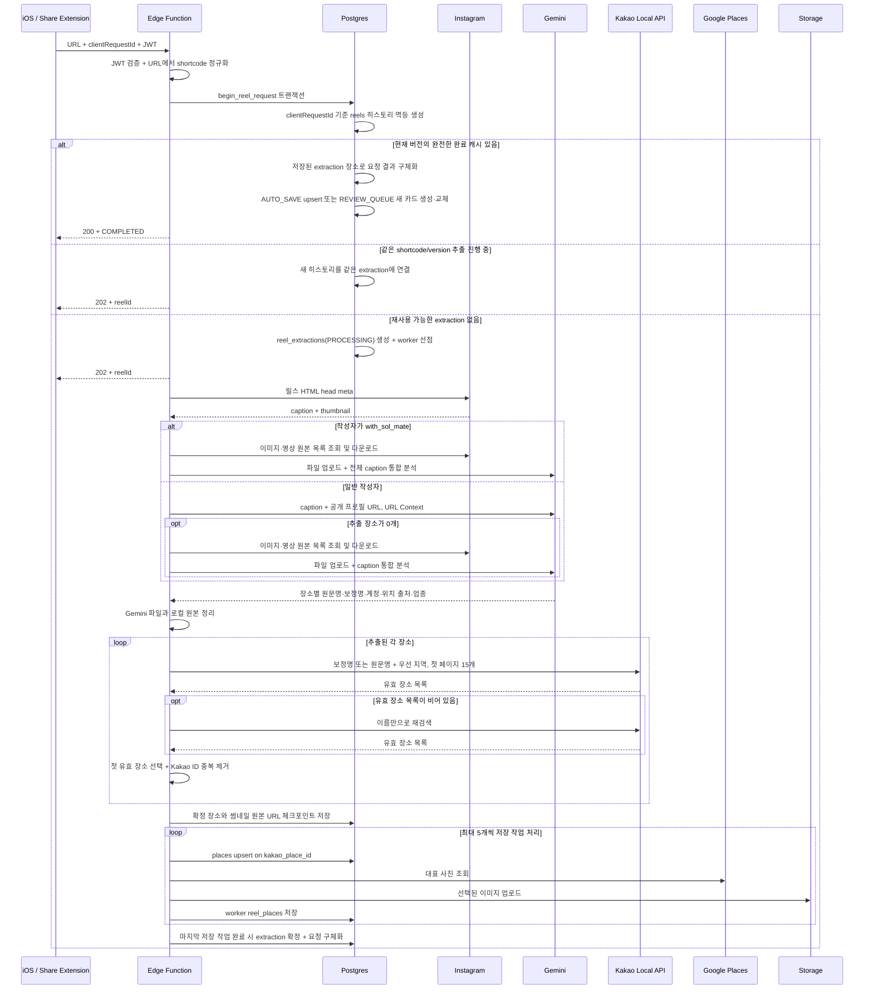

# 릴스 장소 저장 구현 플로우

- 엔드포인트: `POST /functions/v1/save-instagram-reel` (`AUTO_SAVE`), `POST /functions/v1/save-instagram-reel-v2` (`REVIEW_QUEUE`)
- 구현: `supabase/functions/save-instagram-reel`
- 처리: 접수는 동기, 장소 추출·저장은 비동기
- 장소 자연키: Kakao Local API `id`
- 파이프라인 버전: `11` - 2026-Yeogidam의 장소 분석 이식

## 1. 요청 계약

앱↔서버의 기존 v1/v2 엔드포인트, 요청 필드, 응답 필드·타입, HTTP 상태 코드와 오류 형식은 유지한다. 장소명 보정과 위치 출처 단서는 서버 내부 분석에서만 사용하며 앱 요청·응답에 추가하지 않는다. `PIPELINE_VERSION`은 서버 내부 추출 캐시 구분값이다.

```http
POST /functions/v1/save-instagram-reel
Authorization: Bearer <Supabase user JWT>
apikey: <Supabase anon key>
Content-Type: application/json
```

```json
{
  "instagramUrl": "https://www.instagram.com/reel/SHORTCODE",
  "source": "instagram_share",
  "clientRequestId": "6d8c1b73-5be1-4c29-9241-5da0b829e81a"
}
```

클라이언트는 사용자가 명시적으로 공유하거나 URL을 입력할 때마다 새 `clientRequestId` UUID를 만들고, 응답을 확신할 수 없는 네트워크 재시도에는 같은 값을 유지한다. `(user_id, request_id)`가 유일하므로 같은 ID의 재전송은 같은 `reels` 히스토리로 수렴하고 대기함 순서나 저장 시각도 다시 갱신하지 않는다. 반대로 같은 릴스라도 새 ID로 보낸 명시적 재요청은 별도의 `reels` 히스토리를 만든다. 구버전 클라이언트가 ID를 보내지 않으면 서버가 호환용 UUID를 생성하지만, 클라이언트 재시도 간 멱등성은 보장할 수 없다.

새 추출을 시작하거나 진행 중인 공용 추출에 합류하면 `202`와 `reelId`를 반환한다. 현재 파이프라인 버전의 완료 캐시를 즉시 재사용하면 `200`, `status: COMPLETED`, `placeIds`를 반환한다. 화면은 신규 추출과 캐시 재사용을 구분해 표시하지 않는다.

내부 장소 배치 호출은 `apikey` 헤더의 값이 서버의
`SUPABASE_SERVICE_ROLE_KEY`와 정확히 일치할 때만 허용한다. 레거시
service-role JWT를 `Authorization`에 보내는 기존 내부 호출도 허용한다.
일반 사용자 요청은 기존처럼 `Authorization`의 사용자 JWT를 `auth.getUser()`로
검증한다. 두 릴스 함수의 `verify_jwt=true` 설정은 유지한다.

서버 전용 `retry_reel_processing` 요청은 extraction·worker·처리 토큰을
검증하고 기존 요청의 `begin_reel_request` 재선점 경로를 사용한다. 15분 이상
진행이 멈춘 요청만 새 처리 토큰으로 재실행하며 요청 히스토리는 추가하지 않는다.
저장된 배치가 있으면 이어서 처리하고, 없으면 추출부터 다시 진행한다.

## 2. 전체 순서


```mermaid
sequenceDiagram
    participant U as iOS / Share Extension
    participant F as Edge Function
    participant D as Postgres
    participant I as Instagram
    participant AI as Gemini
    participant K as Kakao Local API
    participant G as Google Places
    participant S as Storage

    U->>F: URL + clientRequestId + JWT
    F->>F: JWT 검증 + URL에서 shortcode 정규화
    F->>D: begin_reel_request 트랜잭션
    D->>D: clientRequestId 기준 reels 히스토리 멱등 생성
    alt 현재 버전의 완전한 완료 캐시 있음
        D->>D: 저장된 extraction 장소로 요청 결과 구체화
        D->>D: AUTO_SAVE upsert 또는 REVIEW_QUEUE 새 카드 생성·교체
        F-->>U: 200 + COMPLETED
    else 같은 shortcode/version 추출 진행 중
        D->>D: 새 히스토리를 같은 extraction에 연결
        F-->>U: 202 + reelId
    else 재사용 가능한 extraction 없음
        D->>D: reel_extractions(PROCESSING) 생성 + worker 선점
        F-->>U: 202 + reelId
        F->>I: 릴스 HTML head meta
        I-->>F: caption + thumbnail
        alt 작성자가 with_sol_mate
            F->>I: 이미지·영상 원본 목록 조회 및 다운로드
            F->>AI: 파일 업로드 + 전체 caption 통합 분석
        else 일반 작성자
            F->>AI: caption + 공개 프로필 URL, URL Context
            opt 추출 장소가 0개
                F->>I: 이미지·영상 원본 목록 조회 및 다운로드
                F->>AI: 파일 업로드 + caption 통합 분석
            end
        end
        AI-->>F: 장소별 원문명·보정명·계정·위치 출처·업종
        F->>F: Gemini 파일과 로컬 원본 정리
        loop 추출된 각 장소
            F->>K: 보정명 또는 원문명 + 우선 지역, 첫 페이지 15개
            K-->>F: 유효 장소 목록
            opt 유효 장소 목록이 비어 있음
                F->>K: 이름만으로 재검색
                K-->>F: 유효 장소 목록
            end
            F->>F: 첫 유효 장소 선택 + Kakao ID 중복 제거
        end
        F->>D: 확정 장소와 썸네일 원본 URL 체크포인트 저장
        loop 최대 5개씩 저장 작업 처리
            F->>D: places upsert on kakao_place_id
            F->>G: 대표 사진 조회
            F->>S: 선택된 이미지 업로드
            F->>D: worker reel_places 저장
        end
        F->>D: 마지막 저장 작업 완료 시 extraction 확정 + 요청 구체화
    end
```

## 3. Instagram 추출

캡션은 공개 HTML의 `og:description`, `description`, `twitter:description` 순서로
읽는다. 원본과 같은 iPhone Safari User-Agent를 사용한다. 작성자는
`twitter:title`, `og:title`, 각 description의 작성자 표기를 차례로 확인하며,
본문의 첫 @멘션을 작성자로 추측하지 않는다. title은 작성자 파싱에만 사용하고
DB에는 저장하지 않는다. 메타데이터 미리보기는 `twitter:image`, `og:image`
순서이며 `/p/` 원본 비율 썸네일 보강과 Storage 저장은 기존 흐름을 유지한다.

캡션 자체가 없거나 공백이면 `IG_CAPTION_NOT_FOUND`로 중단한다. 캡션 추출
결과의 장소가 0개인 경우와 캡션 자체가 없는 경우를 구분한다.

미디어 분석이 필요하면 `instagram_media.ts`가 embed 페이지의 포함 데이터를
먼저 읽고, 원본이 없으면 공개 페이지와 공개 GraphQL 응답을 확인한다. 대상
shortcode의 이미지·영상만 사용하며 캐러셀의 모든 항목을 원래 순서로 보존한다.
릴스는 영상 원본 한 개를 요구하고, 영상 대신 썸네일을 분석하지 않는다.

원본과 동일하게 최대 20개, 파일당 100MiB, 전체 200MiB를 허용하며 MIME과
실제 다운로드 크기를 검사한다. Instagram CDN의 HTTPS URL만 허용한다.
리다이렉트도 CDN 검증을 통과해야 한다. 파일은 `/tmp`에 스트리밍으로 저장하고
다운로드 실패와 분석 종료 시 정리한다.

## 4. Gemini 단서 추출

분석 규칙과 두 프롬프트는 `2026-Yeogidam`의 `GeminiPlaceNameExtractor`에서
이식했다. 일반 작성자는 캡션을 먼저 분석하고 장소가 없으면 원본 미디어를
분석한다. `with_sol_mate` 작성자는 처음부터 캡션·미디어를 통합 분석한다.
캡션 분석 오류나 카카오 매칭 실패를 미디어 분석 조건으로 사용하지 않는다.

내부 응답은 다음과 같다. 외부 API 요청·응답에 이 필드를 추가하지 않는다.

```json
{
  "places": [{
    "nameInCaption": "영상 속 카페",
    "nameSearchHint": "검색할 정식 명칭",
    "accountHints": ["@cafe_account"],
    "locationHints": [{
      "type": "ADDRESS",
      "value": "서울 성동구 왕십리로 10",
      "basis": "VIDEO"
    }],
    "categoryHint": "카페"
  }]
}
```

위치 출처는 `CAPTION`, `INFERRED`, `VIDEO`, `IMAGE`다. 캡션에 없는 위치라는
이유로 영상·이미지·프로필 단서를 제거하거나 정규식 주소를 보강하지 않는다.
장소의 최초 등장 순서와 장소별 정보 분리·중복 제거 규칙은 원본 프롬프트를
따른다. 장소 개수 상한은 내부 응답 스키마에 두지 않는다.

캡션의 @멘션에서 중복 없는 공개 프로필 URL을 만들어 함께 전달하고,
`URL Context`로 장소 계정과 연결된 공식 페이지를 확인하도록 요청한다.
실제로 접근하지 못한 프로필 내용은 생성하지 않도록 프롬프트에서 제한한다.

캡션 분석은 `/v1/interactions`, 미디어 분석은
`/v1beta/models/{model}:generateContent`를 사용한다. 미디어를 Files API로
업로드한다. Deno 스트림은 Content-Length를 전송하지 않으므로 메모리에 최대
8MiB만 올려 resumable offset과 서버의 조각 단위에 맞춰 순차 전송한다. 마지막
조각에서 finalize하고 최대 2분 동안 ACTIVE 상태를 기다린 뒤 높은 미디어 해상도로
분석한다. 성공·실패 모두 업로드 파일 삭제와 로컬 파일 정리를 시도한다.
캡션 요청 제한은 20초, 미디어 관련 HTTP 요청은 120초, 다운로드는 30초다.

원본처럼 Gemini 단일 key/model을 사용한다. 기존 공급자 전환·키 fallback·2차
후보 판단 모듈은 새 분석 경로에서 호출하지 않는다. `GEMINI_API_KEY`,
`GEMINI_MODEL`은 필수이고 기본 모델을 임의로 지정하지 않는다.

## 5. Kakao 검색과 선택

`source_analysis.ts`와 `source_kakao.ts`가 원본 `KakaoPlaceSearcher`를 이식한다.

1. `nameSearchHint`가 있으면 검색명으로 사용하고, 없으면 `nameInCaption`을 사용한다.
2. 주소에서 지역을 뽑을 수 있으면 캡션, 영상, 이미지, 추론 주소 순으로 확인한다.
   주소 내부에서는 마지막 읍·면·동, 마지막 구·군, 마지막 시 순으로 선택한다.
3. 주소에서 지역을 얻지 못하면 영상, 이미지, 추론, 캡션 지역 순으로 선택한다.
4. 검색명에 지역이 이미 포함되어 있으면 반복해서 붙이지 않는다.
5. 이름 + 지역으로 첫 페이지 최대 15개를 검색한다. 유효 장소가 없으면 이름만으로 검색한다.
6. 처음 유효 결과가 나온 검색의 첫 장소를 선택한다. 이름·주소 재검증이나 2차 AI 판단은 없다.

카카오 ID, 명칭, 지번 주소, 유효 좌표가 없는 항목은 원본처럼 건너뛴다.
응답 항목이 있는데 전부 불완전하면 분석 오류이며 빈 검색 결과로 바꾸지 않는다.
HTTP·네트워크·응답 형식 오류도 중단한다. 카카오 요청 제한은 5초다.
확정 장소는 카카오 ID로 중복 제거하고 성공한 장소의 입력 순서를 유지한다.
모든 장소가 검색되지 않으면 `KAKAO_PLACE_NOT_FOUND`로 연결한다.

원본 Java 클래스와 이식 파일의 대응은 다음과 같다.

| 원본 | 이식 파일 |
|---|---|
| MediaExtractionPipeline, KakaoPlaceSearcher의 검색어 규칙 | source_analysis.ts |
| KakaoPlaceSearcher의 요청·유효 장소 파싱 | source_kakao.ts |
| InstagramMediaSourceReader, InstagramMediaDownloader | instagram_media.ts |
| GeminiPlaceNameExtractor, GeminiFileClient | source_gemini.ts |
| 캡션·미디어 프롬프트 | source_prompts.ts |

## 6. 저장과 중복

`places.kakao_place_id` 유니크 제약으로 upsert한다.

- `places.id`: 내부 UUID
- `kakao_place_id`: 외부 자연키
- `kakao_place_url`: `https://map.kakao.com/link/map/{id}`
- `source_address`: 캡션·영상·이미지 등에서 얻은 주소 단서를 기존 필드에 문자열로 저장한다
- `road_address`, `address`, 좌표, 전화, 카테고리: Kakao 정규화 결과

`reels`는 추출 결과 자체가 아니라 사용자 요청 히스토리다. 사용자가 명시적으로 다시 공유하면 같은 사용자·shortcode라도 새 행이 생기고, 네트워크 재전송만 같은 `clientRequestId`로 한 행에 수렴한다. 각 요청은 `extraction_id`로 공용 추출 attempt를 참조하며 기존 앱 호환을 위해 `reels.place_id`는 해당 결과의 첫 장소를 계속 가리킨다.

`reel_extractions`와 `reel_extraction_places`는 사용자와 무관한 추출 결과다. 현재 `PIPELINE_VERSION`의 `(instagram_shortcode, pipeline_version)`에 대해 진행 중인 attempt 또는 `COMPLETED/cacheable=true`인 완전한 결과 하나만 활성 캐시가 된다. 같은 사용자든 다른 사용자든 완료 결과가 있으면 Instagram·Gemini·Kakao를 다시 호출하지 않고 저장된 장소 목록을 사용하며, 동시에 들어온 요청도 한 worker에 합류한다. 알려진 장소 매칭 실패가 섞인 부분 성공은 `COMPLETED/cacheable=false`, 전체 실패는 `FAILED/cacheable=false`로 보존하므로 다음 명시적 요청은 새 extraction을 만들어 다시 추출한다.

`REVIEW_QUEUE` 대기함은 요청 히스토리와 분리된 사용자별 `reel_queue_batches`·`reel_queue_items`다.

- 같은 사용자의 같은 shortcode에 미처리(open) batch가 있어도 재공유가 성공하면 기존 batch와 item을 물리 삭제하고, 릴스의 전체 장소를 새 `PENDING` item으로 담은 batch를 생성한다. 새 batch는 실제 생성 시각인 `created_at DESC, id DESC` 순서로 상단에 보인다. 완료 cache를 재사용하면 즉시 교체하고, 새 추출이 필요하면 추출 성공 시에만 삭제와 생성을 한 트랜잭션으로 수행한다. 따라서 추출 중이거나 실패하면 기존 카드는 그대로 남고, 재공유 전 item ID로 늦게 도착한 저장 요청은 새 카드를 변경하지 못한다. 재공유만으로는 `saved_places.last_saved_at`도 바뀌지 않는다.
- 모든 item을 저장하거나 버리면 batch에 `resolved_at`을 기록한다. 이후 같은 릴스를 다시 공유하면 새 batch와 item을 만든다.
- 명시적 재공유는 open batch 유무와 관계없이 언제나 새 `reels` 히스토리를 남긴다.

`saved_places(user_id, place_id)`는 사용자별 장소를 한 행으로 유지한다. 처음 저장하면 행을 만들고 이미 있으면 행을 추가하지 않은 채 `last_saved_at = now()`로 갱신한다. 보관함 조회는 `last_saved_at DESC, id DESC`이므로 재저장한 장소가 상단으로 이동한다. 공용 extraction worker의 `AUTO_SAVE`는 장소를 처리할 때마다 사용자 보관함에 쓰지 않고, extraction을 확정하는 한 트랜잭션에서 연결된 요청의 장소를 한꺼번에 upsert한다.

`reel_places(reel_id, place_id, position)`는 extraction worker의 중간 결과와 구버전 호환 관계를 보존한다. `position`은 성공한 Gemini 결과의 상대 순서이며, 완료 후 재사용할 공용 목록은 `reel_extraction_places`에 고정된다.

인증 사용자는 추출·대기함 관계를 임의로 쓰지 못하고, RLS를 통해 자신이 요청한 extraction과 자신의 batch/item만 읽는다. iOS의 장소 상세는 `user_related_reels` 뷰로 같은 shortcode의 반복 히스토리를 하나로 정리해 최신 관련 릴스를 보여주며, 썸네일을 누르면 원본 `instagram_url`을 연다.

구버전 React Native 앱(`fe-release/1.0.1`)의
`reels?select=...,reel_places!inner(place_id)&reel_places.place_id=eq.<placeId>`
요청도 같은 `user_related_reels` 결과를 사용한다. DB의
`public.reel_places(public.reels)` computed relationship이 기존 embedding을
덮어쓰므로 앱의 URL·필터·응답 필드는 바뀌지 않는다. 부모 `reels`에서 읽는
작성자·캡션·썸네일도 그대로 유지한다. 반환형은 `SETOF user_related_reels`이며
이 호환 계약의 중첩 선택 필드는 `place_id`다. 물리 `reel_places` 행 ID나 대기함
item ID를 합성하지 않으며, 기존 테이블에 연결을 복제하거나 worker의 중간
결과를 지우지 않는다. 따라서 재공유 중복 제거와 stale attempt 제외도 새
조회와 같은 기준을 따른다.

이 함수는 호출자 권한으로 실제 부모 행과 소유자를 다시 확인한다. 요청에서
넘긴 composite의 `user_id`나 `extraction_id`는 신뢰하지 않는다. 독립적인
`/rest/v1/reel_places` 조회와 서버의 worker 쓰기에는 영향을 주지 않는다.
이전 `extraction_id IS NULL` 자료는 뷰의 legacy 경로로 계속 조회한다.

장소 매칭 결과가 달라지는 코드를 배포할 때 `PIPELINE_VERSION`을 올리지 않으면 완료된 같은 shortcode는 기존 결과를 계속 재사용한다. 반대로 버전을 올리면 새 extraction을 만들고 과거 extraction과 요청 히스토리는 그대로 보존한다. 사용자 단위 `saved_places`도 자동 삭제하지 않으므로 과거 오탐을 제거하려면 다른 릴스가 같은 장소를 참조하는지 확인하는 별도 정리 정책이 필요하다.

Naver 전용 `naver_place_id`, `naver_link`, `naver_thumbnail_url`은 Kakao 전환 마이그레이션에서 제거한다. 장소 식별자와 지도 링크의 SSOT는 각각 `kakao_place_id`, `kakao_place_url`이다.

`places.source_address`는 공용 장소 행에 저장되므로 릴스별 주소 이력이 아니다. 같은 Kakao 장소가 다른 캡션의 상세주소로 다시 저장되면 최근 non-null 원문 주소로 바뀔 수 있다. 릴스별 원문 보존이 필요하면 extraction 관계에 별도 컬럼을 두어야 한다.

추출 중 `places`·worker `reel_places`·Storage 쓰기는 단계별로 일어나므로 실패한 attempt가 공용 장소나 중간 관계를 일부 남길 수 있다. 다만 재사용 캐시 확정과 새 흐름의 `AUTO_SAVE` 보관함 반영은 `finalize_reel_extraction` 트랜잭션에서 함께 처리되어 사용자 보관함에 부분 결과를 공개하지 않는다.

## 7. 썸네일

1. `places.thumbnail_url` 캐시
2. DB 월간 예약 한도 통과 후 Google Places 사진
3. Instagram `og:image`
4. Kakao 장소 상세 페이지 `og:image`
5. 모두 실패하면 앱 placeholder

외부 URL을 그대로 보관하지 않고 `place-thumbnails` Storage에 업로드한다.

## 8. 상태

| 상태 | 의미 |
|---|---|
| `PROCESSING` | 접수 후 백그라운드 처리 중 |
| `COMPLETED` | 장소가 1개 이상 매칭되어 공용 추출 결과와 사용자별 반영이 완료됨 |
| `FAILED` | 구조화 또는 저장 실패 |

| 실패 사유 | 대표 원인 |
|---|---|
| `IG_FETCH_FAILED` | Instagram 요청 실패 또는 non-2xx 응답 |
| `IG_CAPTION_NOT_FOUND` | HTML 응답은 성공했지만 description 메타데이터 없음 |
| `PROVIDER_CONFIG_MISSING` | Gemini 또는 Kakao API 키 누락 |
| `GEMINI_PLACE_NOT_FOUND` | Gemini가 추출한 장소가 0개 |
| `KAKAO_PLACE_NOT_FOUND` | Kakao 후보가 없거나 Gemini가 최종 선택하지 않아 저장할 장소가 0개 |
| `PLACE_NOT_FOUND` | 이전 버전 호환용 일반 장소 탐색 실패 |
| `UNKNOWN` | DB·Storage 또는 예상하지 못한 예외 |

`COMPLETED`가 모든 캡션 장소의 저장을 보장하지는 않는다. 확인된 일부 Kakao 매칭 실패를 포함한 완료 결과는 `cacheable=false`라 다음 명시적 요청에서 재추출한다. 다음은 실패 상태가 아닌 부분 성공 또는 공급자 특성상 감지하기 어려운 누락이다.

- Gemini 모델이 캡션의 일부 장소를 응답에서 누락함
- 여러 Gemini 항목 중 일부만 Kakao 후보 선택에 성공함
- 동일 Kakao 장소 ID가 캡션에 반복되어 하나로 합쳐짐
- 썸네일 제공자가 모두 실패하여 이미지 없이 장소만 저장됨

운영에서 저장 개수가 예상보다 적으면 캡션과 미디어의 장소, `source_place_hints_extracted`의 단서, `source_kakao_search`의 검색어·유효 후보 수, 최종 `reel_places.position`과 저장 작업 상태를 차례로 확인한다.

이전 정규식 검증 방식의 조사·실패 매트릭스는 [MVP 장소 매칭 보고서](mvp-place-matching-release-report.md)에 보존한다. 현재 동작은 이 문서의 버전 11 흐름을 따른다.
